# Backend & Distributed Systems Course — Easy Edition

This is a beginner-friendly version of the course. It uses simple English, real-life examples, pictures (diagrams), video tutorials, and hands-on practice for every module. You don't need to be an expert to start — just basic backend knowledge (you can build a simple API and use a database).

**How to use this course:** Start with **Module 0 (Overview)** to see the full map. Then work through each module in order — read, diagram, video, hands-on. Don't skip the hands-on part.

---

## Module 0: Course Overview — The Full Backend & Distributed Systems Map

### Module overview

**Goal:** See every topic this course covers and understand how they connect in a real production system — before diving into Module 1 (Networking).

**Time:** ≈20 min read · no hands-on required (optional reflection at the end)

**How to read this module:**
1. Study the **system connection diagram** — how layers talk to each other
2. Follow the **learning path** — module order 0 → 16
3. Skim the **topic map** — nothing in the course is left out

---

### Part 1 — How Everything Connects (Production View)

This is the map junior backend developers should keep in mind: a user request touches almost every layer below.

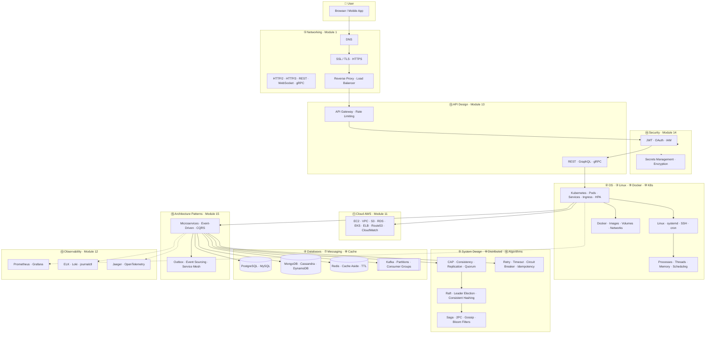

#### One request, step by step
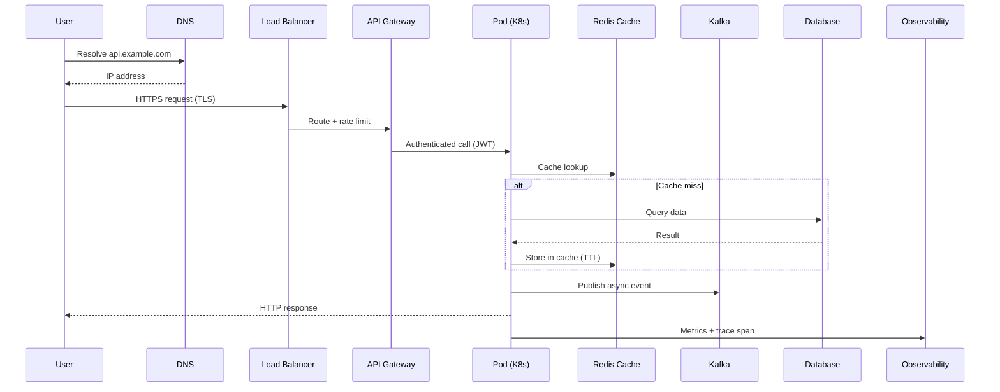

---

### Part 2 — Course Learning Path (Modules 0–16)

Follow this order — each module builds on the previous.

```mermaid
flowchart LR
    M0[0 · Overview] --> M1[1 · Networking]
    M1 --> M2[2 · Operating Systems]
    M2 --> M3[3 · Linux]
    M3 --> M4[4 · Databases]
    M4 --> M5[5 · System Design]
    M5 --> M6[6 · Distributed Systems]
    M6 --> M7[7 · Messaging / Kafka]
    M7 --> M8[8 · Caching]
    M8 --> M9[9 · Containers]
    M9 --> M10[10 · Kubernetes]
    M10 --> M11[11 · Cloud AWS]
    M11 --> M12[12 · Observability]
    M12 --> M13[13 · API Design]
    M13 --> M14[14 · Security]
    M14 --> M15[15 · Architecture Patterns]
    M15 --> M16[16 · Algorithms]
```

| # | Module | Role in the system |
|---|--------|-------------------|
| 0 | **Overview** | Map of all topics & connections — start here |
| 1 | **Networking** | How services communicate |
| 2 | **Operating Systems** | How your code runs on hardware |
| 3 | **Linux** | How you operate production servers |
| 4 | **Databases** | Where data lives |
| 5 | **System Design Basics** | Vocabulary for scaling trade-offs |
| 6 | **Distributed Systems** | Core of the subject |
| 7 | **Messaging / Kafka** | Async communication between services |
| 8 | **Caching** | Speed layer in front of databases |
| 9 | **Containers** | Packaging apps consistently |
| 10 | **Kubernetes** | Running containers at scale |
| 11 | **Cloud (AWS)** | Renting infrastructure |
| 12 | **Observability** | Seeing what your system is doing |
| 13 | **API Design** | How clients talk to your services |
| 14 | **Security** | Protecting data and access |
| 15 | **Architecture Patterns** | Proven ways to structure big systems |
| 16 | **Algorithms** | Clever tricks inside distributed systems |

---

### Part 3 — Topic Map: Foundations (Modules 1–4)

#### 1. Networking
Distributed systems communicate over networks — the most important foundation.

**Learn:** OSI model · TCP vs UDP · HTTP/HTTPS · HTTP/2 & HTTP/3 · REST APIs · WebSockets · gRPC · DNS · Load balancing · Reverse proxies · SSL/TLS · Latency & bandwidth

#### 2. Operating Systems
Understand how applications run.

**Topics:** Processes vs threads · Context switching · Memory management · Virtual memory · Locks · Mutex · Semaphores · Scheduling · Deadlocks · File systems

#### 3. Linux
Most distributed systems run on Linux.

**Learn:** Bash · SSH · Cron · Systemd · Networking commands · `top` · `htop` · `netstat` · `ss` · `lsof` · `iptables` · `journalctl`

#### 4. Databases
Understand storage.

**SQL:** PostgreSQL · MySQL

**NoSQL:** MongoDB · Cassandra · DynamoDB · Redis

**Concepts:** Indexes · Transactions · Isolation levels · MVCC · Replication · Sharding

---

### Part 4 — Topic Map: Core Systems (Modules 5–8)

#### 5. System Design Basics
**Core topics:** Horizontal scaling · Vertical scaling · Stateless vs stateful services · CAP theorem · Consistency · Availability · Partition tolerance · Eventual vs strong consistency · Replication · Leader election · Quorum · Consensus basics

#### 6. Distributed System Concepts
The heart of the subject.

**Communication:** RPC · gRPC · Message queues

**Consistency:** Strong · Eventual · Read-after-write

**Replication:** Leader-follower · Multi-leader · Leaderless

**Partitioning:** Sharding · Consistent hashing

**Failures:** Network partition · Retry · Timeout · Circuit breaker · Idempotency · Backoff · Heartbeats

**Consensus:** Raft · Paxos (high level) · ZooKeeper · etcd

**Time:** Logical clocks · Lamport clocks · Vector clocks

**Transactions:** Two-phase commit · Saga pattern

#### 7. Messaging Systems
**Tools:** Kafka · RabbitMQ · ActiveMQ · NATS

**Topics:** Producer · Consumer · Partition · Offset · Consumer groups · Ordering · At-least-once · At-most-once · Exactly-once (practical)

*Go deeper here if you already use Kafka.*

#### 8. Caching
**Learn:** Redis · Cache-aside · Write-through · Write-back · Cache invalidation · TTL

---

### Part 5 — Topic Map: Infrastructure (Modules 9–12)

#### 9. Containers
Docker · Images · Layers · Registry · Volumes · Networks

#### 10. Kubernetes
Pods · Deployments · Services · StatefulSets · ConfigMaps · Secrets · Ingress · HPA · Service discovery

*Deepen this if you already have K8s experience.*

#### 11. Cloud (AWS)
EC2 · VPC · IAM · S3 · RDS · DynamoDB · EKS · ECS · ELB · Auto Scaling · CloudWatch · Route53

#### 12. Observability
**Logging:** ELK · Loki

**Metrics:** Prometheus · Grafana

**Tracing:** Jaeger · OpenTelemetry

---

### Part 6 — Topic Map: Production & Patterns (Modules 13–16)

#### 13. API Design
REST · GraphQL · gRPC · Authentication · JWT · OAuth · Rate limiting

#### 14. Security
TLS · Certificates · OAuth · JWT · Secrets management · Encryption · IAM

#### 15. Architecture Patterns
Microservices · Event-driven architecture · CQRS · Event sourcing · Saga · Outbox pattern · Service mesh · API Gateway

#### 16. Algorithms in Distributed Systems
Consistent hashing · Bloom filters · Merkle trees · Gossip protocol · Leader election · Distributed locks

---

### Part 7 — Before You Start Module 1

#### Module checklist
- ✅ I reviewed the production connection diagram
- ✅ I understand the module order (0 → 16)
- ✅ I know which topics belong to which module
- ✅ I can trace a user request through DNS → LB → API → Pod → Cache/DB → Observability

#### Optional reflection
Pick one path on the diagram (e.g. "cache hit" vs "cache miss") and explain it aloud in 30 seconds — if you can, you're ready for Module 1.

---

## Module 1: Networking — How Computers Talk to Each Other

### Module overview

**Goal:** Understand how data moves from a user's browser to your backend — and back — so distributed systems, APIs, and cloud deployments make sense.

**Suggested path (≈45 min read + 20 min hands-on):**

| Step | Section | Topics |
|------|---------|--------|
| 1 | The Big Picture | Mental model + request flow diagram |
| 2 | Foundations | Network, IP, ports, OSI layers |
| 3 | Transport & Naming | TCP vs UDP, DNS |
| 4 | Web Protocols | HTTP/S, TLS, HTTP/2 & HTTP/3, REST |
| 5 | APIs & Real-Time | WebSockets, gRPC |
| 6 | Production Edge | Reverse proxy, load balancing, latency |
| 7 | Wrap-Up | Full lifecycle diagram + checklist |
| 8 | Practice | Videos + terminal exercises |

---

### Part 1 — The Big Picture

Start here if networking feels abstract. This part gives you the mental model before the details.

#### How computers talk
When you open a website, your computer (**client**) sends a message to another computer (**server**) and gets a reply. Networking is the shared set of rules that makes this work — like a common language both machines understand.

#### Real-life analogy
Sending a **letter**: you write an address (IP), put the message in an envelope (packet), and the postal system (network) delivers it. Important mail needs proof of delivery → **TCP**. Casual news where a lost item is fine → **UDP** (video calls, gaming).

#### Request flow diagram
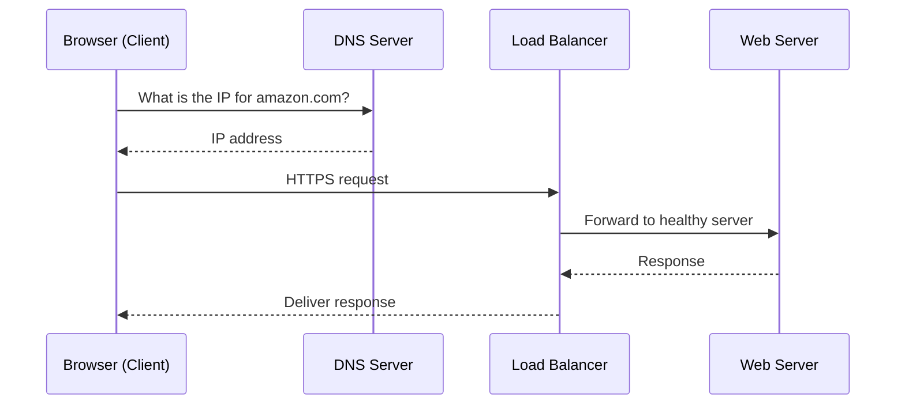

#### Quick reference
| Term | One-line meaning |
|------|------------------|
| **DNS** | Turns `google.com` into an IP address |
| **TCP** | Reliable delivery — websites, APIs, databases |
| **UDP** | Fast, may lose packets — video, gaming |
| **HTTPS** | HTTP encrypted with TLS |
| **Load balancer** | Spreads traffic across many servers |

---

### Part 2 — Foundations: Addresses & Layers

How devices are identified and how the OSI model organizes networking into layers.

#### 1. What is a Network?
A **network** is devices connected to exchange data. Every web app depends on it.

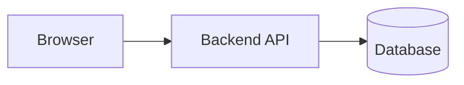

Without networking, distributed systems cannot exist.

#### 2. IP Address
Every device has an **IP address** — like a house address for a computer.

| Type | Example | Notes |
|------|---------|-------|
| Private | `192.168.1.10` | Local network only |
| Public | `13.232.xxx.xxx` | Reachable on the Internet |
| Localhost | `127.0.0.1` | Your own machine |

#### 3. Ports
One machine runs many apps. **Ports** route traffic to the right application.

| Service | Port |
|---------|------|
| HTTP / HTTPS | 80 / 443 |
| Node.js dev | 3000 |
| PostgreSQL | 5432 |
| Redis | 6379 |

`13.232.xxx.xxx:3000` → IP finds the machine, port finds the app.

#### 4. OSI Model
A 7-layer map of how data travels. Engineers mostly care about layers **7 (Application)**, **4 (Transport)**, and **3 (Network)**.

| Layer | Role | Examples |
|-------|------|----------|
| 7 Application | Apps users interact with | HTTP, DNS |
| 6 Presentation | Format & encryption | TLS |
| 4 Transport | Reliable delivery | TCP, UDP |
| 3 Network | Routing between machines | IP |

---

### Part 3 — Transport & Naming

How data is delivered reliably (or quickly) and how human-readable names become IP addresses.

#### 5. TCP vs UDP

| | TCP | UDP |
|---|-----|-----|
| Delivery | Guaranteed | Best-effort |
| Order | Preserved | Not guaranteed |
| Speed | Slower | Faster |
| Use cases | HTTP, APIs, DB | Video, gaming, DNS |

**Rule of thumb:** need correctness → TCP. need speed & can tolerate loss → UDP.

#### 6. DNS (Domain Name System)
DNS maps names to numbers: `google.com` → `142.250.xxx.xxx`. It's the Internet's phonebook. If DNS fails, a healthy server looks "down" to users.

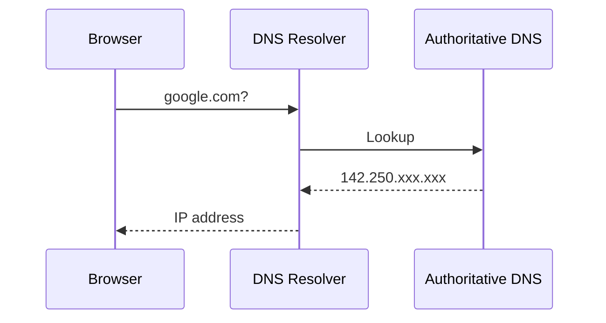

---

### Part 4 — Web Protocols

The protocols that power the web — from plain HTTP to modern encrypted, multiplexed connections.

#### 7. HTTP & HTTPS
**HTTP** — request/response protocol for the web.

```
GET /users HTTP/1.1  →  HTTP/1.1 200 OK
```

**HTTPS** — HTTP wrapped in TLS. Always use in production.

#### 8. SSL/TLS
Encrypts traffic in transit. Without TLS, credentials are visible to anyone on the network path.

**Key pieces:** certificate, CA, TLS handshake, public-key + symmetric encryption.

#### 9. HTTP/2 & HTTP/3
| Version | Improvement |
|---------|-------------|
| HTTP/1.1 | One request at a time per connection |
| HTTP/2 | Multiplexing, header compression |
| HTTP/3 | QUIC over UDP — faster on mobile/flaky networks |

#### 10. REST APIs
Resource-oriented API design using HTTP verbs.

| Method | Purpose | Example |
|--------|---------|---------|
| GET | Read | `GET /users/10` |
| POST | Create | `POST /users` |
| PUT/PATCH | Update | `PATCH /users/10` |
| DELETE | Remove | `DELETE /users/10` |

📖 **Further reading:** [APIs](https://lnkd.in/dsbwPZ6N) · [REST vs GraphQL](https://lnkd.in/gM5VHKQS)

---

### Part 5 — APIs & Real-Time Communication

Patterns beyond classic request/response — persistent connections and high-performance RPC.

#### 11. WebSockets
HTTP closes after each response. **WebSocket** keeps a bidirectional channel open — server can push anytime.

**Use cases:** chat, live notifications, dashboards, multiplayer games.

📖 **Further reading:** [Long Polling vs WebSockets](https://lnkd.in/d9xKD28K)

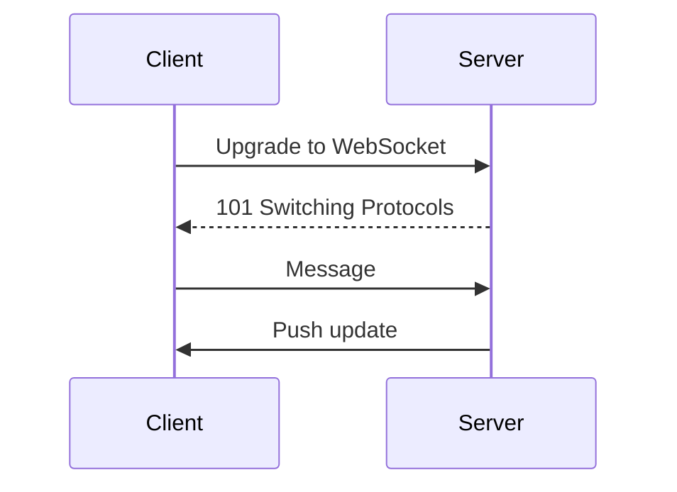

#### 12. gRPC
High-performance **service-to-service** RPC using Protocol Buffers + HTTP/2.

**Why teams use it:** smaller payloads, strong typing, streaming — faster than JSON REST internally.

---

### Part 6 — Production Infrastructure

How real systems handle scale, security at the edge, and performance.

#### 13. Reverse Proxy
Sits in front of backend servers — handles routing, TLS termination, caching, auth.

📖 **Further reading:** [Proxy vs Reverse Proxy](https://lnkd.in/gMTtidBq)

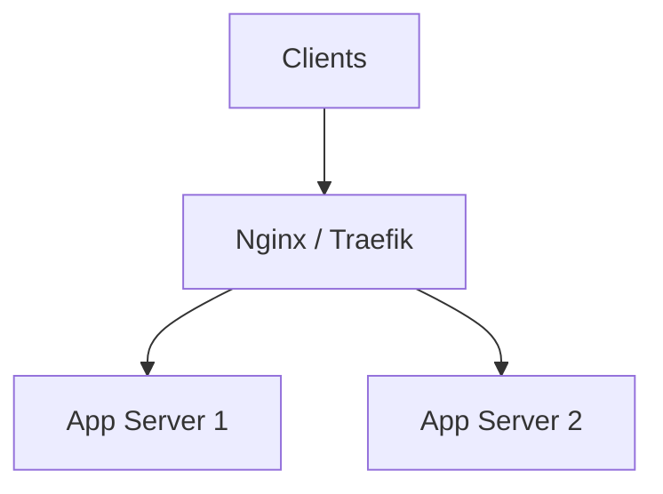

#### 14. Load Balancing
Distributes traffic so no single server is overwhelmed.

📖 **Further reading:** [Load Balancing](https://lnkd.in/gvxfwEUr)

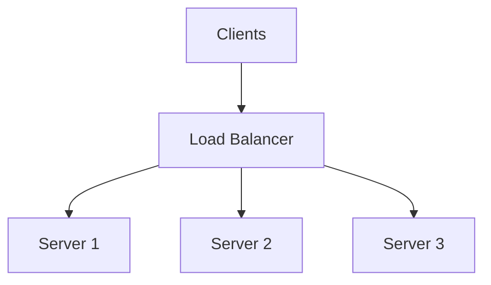

**Algorithms:** Round Robin · Least Connections · IP Hash

#### 15. Latency & Bandwidth
- **Latency** — time for one round trip (e.g. 20 ms). Lower = snappier UX.
- **Bandwidth** — max throughput (e.g. 100 Mbps). Higher = more concurrent data.

> High bandwidth does **not** fix high latency. They measure different things.

---

### Part 7 — End-to-End & Review

Tie everything together, then confirm you can explain each piece.

#### 16. Complete Request Lifecycle
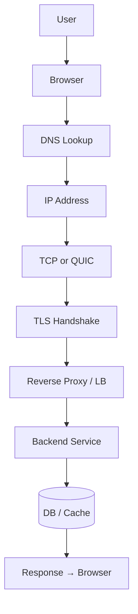

#### 17. Module checklist
- ✅ Network basics, IP addresses, and ports
- ✅ OSI layers engineers actually use
- ✅ TCP vs UDP — when to pick each
- ✅ DNS, HTTP, HTTPS, TLS
- ✅ HTTP/2, HTTP/3, REST
- ✅ WebSockets & gRPC
- ✅ Reverse proxy & load balancing
- ✅ Latency vs bandwidth
- ✅ Full request lifecycle

---

### 🎥 Video tutorials
- **TCP/IP Made Super Easy for Beginners**: https://www.youtube.com/watch?v=LUxeuFz_GQo
- **Zero to Hero: Networking Fundamentals Crash Course**: https://www.youtube.com/watch?v=ltBWJIhcjpA

### 📚 Blog resources
- **APIs**: https://lnkd.in/dsbwPZ6N
- **Long Polling vs WebSockets**: https://lnkd.in/d9xKD28K
- **Proxy vs Reverse Proxy**: https://lnkd.in/gMTtidBq
- **Load Balancing**: https://lnkd.in/gvxfwEUr
- **REST vs GraphQL**: https://lnkd.in/gM5VHKQS
- **CDN**: https://lnkd.in/gaW4Vkpy

### 🛠️ Hands-on task
1. `curl -v https://example.com` — find the TLS handshake and HTTP headers in the output.
2. `ping google.com` — note the `time=` value (latency).
3. `nslookup google.com` — watch DNS resolution.
4. **Reflection:** for each step in the lifecycle diagram, point to where it appeared in your terminal output.

---

## Module 2: Operating Systems — How Your Code Actually Runs

### Module overview

**Goal:** Understand what happens below your application — processes, memory, threads, and scheduling — so production issues like latency spikes, OOM kills, and deadlocks make sense instead of feeling random.

**Suggested path (≈40 min read + 25 min hands-on):**

| Step | Section | Topics |
|------|---------|--------|
| 1 | The Big Picture | OS role, restaurant analogy, process vs thread |
| 2 | Processes & Threads | Isolation, shared memory, context switching |
| 3 | Memory | RAM allocation, virtual memory, leaks |
| 4 | Concurrency | Locks, mutex, semaphores, deadlocks |
| 5 | Scheduling & CPU | Scheduler, cgroups, Kubernetes limits |
| 6 | Storage & I/O | File systems, disk patterns, blocking I/O |
| 7 | Wrap-Up | Production mapping + checklist |
| 8 | Practice | Videos + htop/top exercises |

---

### Part 1 — The Big Picture

Your code never runs alone — the OS shares one machine between many programs. Start here for the mental model.

#### What the OS actually does
The **Operating System** (Linux, Windows, macOS) sits between your app and the hardware. It decides which program gets CPU time, how much RAM each may use, and how they access disk and network — without apps stepping on each other.

#### Real-life analogy
A busy **restaurant kitchen**: one stove (CPU), many chefs (processes) wanting to cook. The head chef (**scheduler**) decides who gets the stove and for how long, switching quickly between dishes so everyone eventually gets served — even though only one dish cooks at any instant.

#### Process vs thread diagram
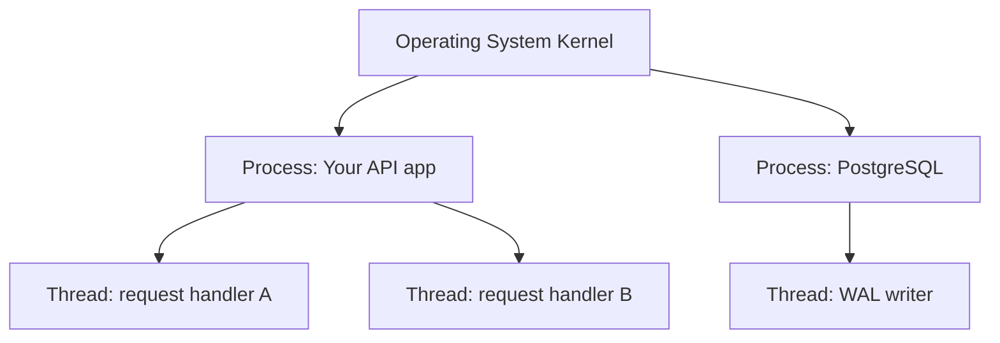

#### Quick reference
| Term | One-line meaning |
|------|------------------|
| **Process** | Running program with its own private memory |
| **Thread** | Worker inside a process; shares memory with siblings |
| **Context switch** | OS pauses one task and runs another |
| **Virtual memory** | Each process thinks it owns all RAM |
| **Deadlock** | Two tasks waiting on each other forever |

---

### Part 2 — Processes & Threads

The building blocks of everything running on a server — and the first place to look when debugging "why is my app slow?"

#### 1. What is a Process?
A **process** is a running instance of a program with its own isolated memory space, file descriptors, and OS-managed resources. Crash one process → others usually survive.

**Examples:** your Node.js server, a Postgres instance, a Redis container each run as separate processes.

#### 2. What is a Thread?
A **thread** is a lighter unit of execution *inside* a process. Threads in the same process **share memory** — fast to create, but risky if two threads write the same data without coordination.

**Examples:** Java Tomcat (thread-per-request), Node.js event loop + libuv thread pool for I/O.

#### 3. Process vs Thread

| | Process | Thread |
|---|---------|--------|
| Memory | Private | Shared within process |
| Creation cost | Higher | Lower |
| Crash impact | Usually isolated | Can kill whole process |
| Best for | Separate services | Parallel work inside one app |

#### 4. Context Switching
When the OS switches from one thread/process to another, it saves CPU state and loads the next — **context switching**. Too many threads/processes → overhead dominates and the machine feels slow even at "low CPU."

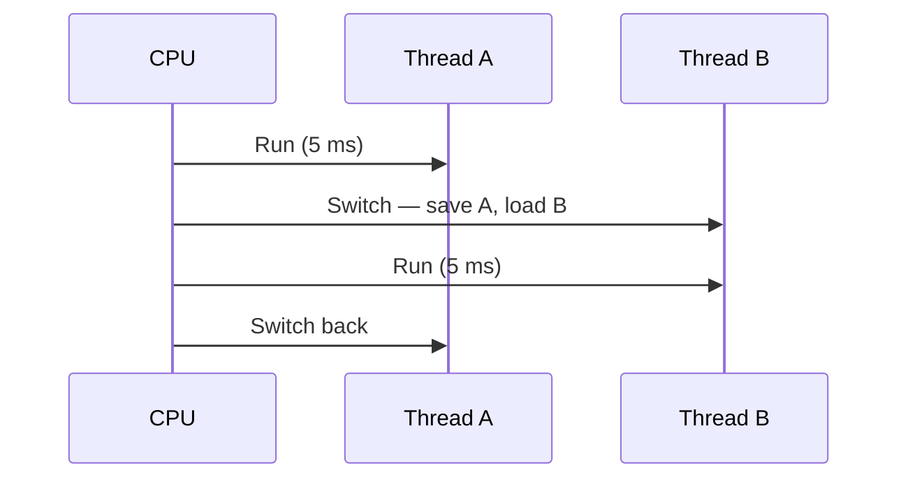

---

### Part 3 — Memory Management

RAM is finite. How the OS allocates it — and what happens when apps misbehave — drives many production incidents.

#### 5. Physical vs Virtual Memory
**Physical RAM** is the actual chips. **Virtual memory** gives each process its own address space; the OS maps virtual addresses to physical RAM (or disk swap) transparently.

**Why it matters:** one buggy process rarely corrupts another's memory directly.

#### 6. Memory Allocation & Leaks
The OS (and runtime like JVM/Node) allocates RAM on request and reclaims it when freed. A **memory leak** is when your app keeps allocating and never releases — RSS grows until **OOM (Out Of Memory)** and Linux kills the process (often seen as pod restarts in Kubernetes).

**Common causes:** unclosed DB connections, unbounded caches, global lists that only grow.

#### 7. Memory in Production

| Signal | What it often means |
|--------|---------------------|
| RSS climbing over days | Memory leak |
| OOMKilled in K8s | Exceeded pod memory limit |
| Swap usage high | Not enough RAM — severe slowdown |
| `ENOMEM` errors | Allocation failed at OS level |

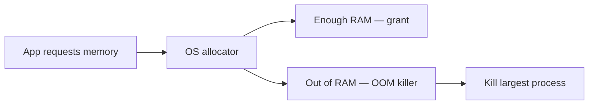

---

### Part 4 — Concurrency & Synchronization

When multiple threads touch shared data, you need rules — or you get corruption, races, and deadlocks.

📖 **Further reading:** [Concurrency vs Parallelism](https://lnkd.in/gGZXhjBD)

#### 8. Locks, Mutex & Semaphores
- **Mutex** — only one thread at a time (mutual exclusion).
- **Semaphore** — fixed number of concurrent accessors.
- **Lock** — general term for exclusive access.

**Example:** a DB connection pool caps concurrent connections with a semaphore — thread 11 waits until a connection is returned.

#### 9. Race Conditions
Two threads read-modify-write the same variable without locking → **race condition**. Output depends on timing — bugs that are painful to reproduce.

#### 10. Deadlocks
Process A holds lock 1, waits for lock 2. Process B holds lock 2, waits for lock 1. Neither proceeds — classic **deadlock**. Databases detect and abort one transaction; your app code must avoid circular lock order.

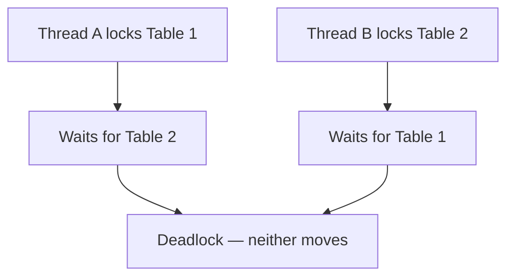

---

### Part 5 — Scheduling & CPU

Who gets the CPU, for how long, and how containers map to OS-level limits.

#### 11. CPU Scheduling
The **scheduler** picks which runnable thread/process gets the next time slice. Algorithms include round-robin, priority-based, and CFS (Completely Fair Scheduler) on Linux.

**Symptom:** latency spikes at odd hours → sometimes another process (backup job, log rotation) stole CPU.

#### 12. Kernel vs User Space
**User space** — your application code. **Kernel space** — OS core (scheduling, drivers, syscalls). Crossing the boundary (**syscall**) has cost — why excessive small I/O or logging can hurt performance.

#### 13. Containers & cgroups
Docker/Kubernetes **CPU limits** map to Linux **cgroups** — the kernel enforces max CPU share. `requests` and `limits` in K8s manifest as OS-level scheduling constraints.

| K8s setting | OS effect |
|-------------|-----------|
| `cpu: 500m` | ~half a core cap |
| `memory: 512Mi` | hard RAM limit → OOM if exceeded |
| No limits | Process can starve others on the node |

---

### Part 6 — Storage & File Systems

How data is organized on disk — and why databases obsess over I/O patterns.

#### 14. File System Basics
Files live in directories; the OS tracks **inodes** (metadata) and **blocks** (data chunks). Sequential reads are faster than random scattered reads — databases tune for this.

#### 15. Blocking vs Non-Blocking I/O
**Blocking I/O** — thread waits until disk/network responds. **Non-blocking / async I/O** — thread continues, notified later (Node.js libuv, Java NIO). Event-loop models shine when many connections wait on I/O, not CPU.

#### 16. Why Backend Engineers Care
- Postgres slow queries → often disk I/O or lock contention, not "bad SQL" alone.
- Log files filling disk → writes fail, app crashes.
- `ulimit` on open files → "too many open connections" under load.

---

### Part 7 — End-to-End & Review

Connect OS concepts to the incidents you'll actually debug in production.

#### 17. From Symptom to OS Layer

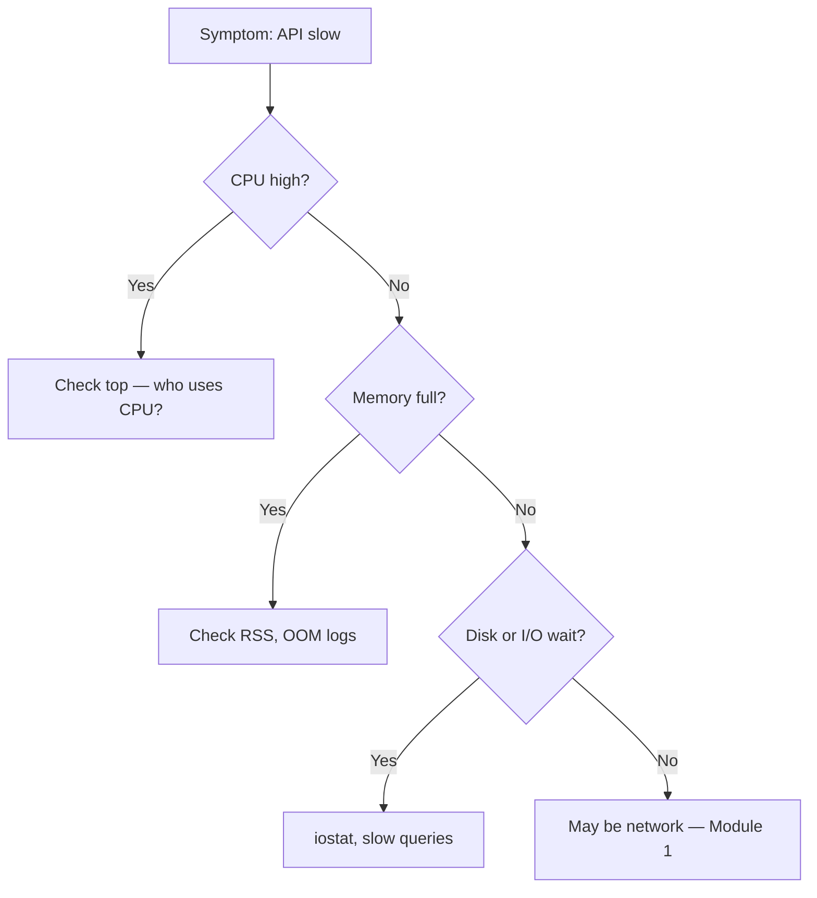

#### 18. Module checklist
- ✅ Process vs thread — isolation vs shared memory
- ✅ Context switching and why too many threads hurt
- ✅ Virtual memory and memory leaks → OOM
- ✅ Mutex, semaphores, deadlocks
- ✅ CPU scheduling and K8s cpu limits / cgroups
- ✅ File systems and blocking I/O basics
- ✅ Map a production symptom to an OS-layer cause

---

### 🎥 Video tutorials
- **Operating Systems – Comprehensive Course for Beginners** (freeCodeCamp): https://www.youtube.com/watch?v=yK1uBHPdp30
- **Process vs Thread explained** — search "Hussein Nasser process vs thread" for a short backend-focused take

### 📚 Blog resources
- **Concurrency vs Parallelism**: https://lnkd.in/gGZXhjBD

### 🛠️ Hands-on task
1. Run `top` or `htop` while your app handles traffic — watch **CPU%**, **MEM%**, and **COMMAND** columns.
2. Note your app's **PID** and run `ps -p <PID> -o pid,rss,vsz,threads` — see memory and thread count.
3. Under load, run `top -H -p <PID>` to see per-thread CPU usage.
4. **Reflection:** if latency doubled, would you suspect CPU, memory, I/O wait, or something else? Which `top` column would you check first?

---

## Module 3: Linux — The Operating System Behind Almost Every Server

### Simple explanation
Nearly every server in the world (AWS, Google Cloud, your company's backend) runs Linux. Learning basic Linux commands is like learning to drive — you need it to operate anything in production.

### Real-life example
When something breaks in production at 2 AM, you SSH (remotely log in) into the server and use Linux commands to find out what's wrong — checking logs, checking if the app is running, checking disk space.

### Diagram: a typical debugging flow
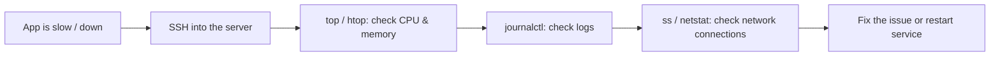

### Key words in simple terms
- **Bash**: the command language you type into the terminal.
- **SSH**: a secure way to remotely log into another computer.
- **Cron**: a built-in scheduler — like an alarm clock for scripts ("run this backup every night at 2 AM").
- **systemd**: keeps your service running — if it crashes, systemd can restart it automatically.

### 🎥 Video tutorial
- **Introduction to Linux – Full Course for Beginners** (freeCodeCamp, Linux Foundation): https://www.youtube.com/playlist?list=PLHbN2j-imEXa7fiBlASvpQRSpWclPg1DH

### 🛠️ Hands-on task
1. If you don't already have one, spin up a free-tier Linux server (AWS EC2 free tier, or just use a virtual machine).
2. Practice these commands: `ls`, `cd`, `cat`, `top`, `ss -tulpn`, `journalctl -xe`.
3. Write a small bash script that prints "Hello World," then schedule it to run every minute using `cron` (`crontab -e`).

---

## Module 4: Databases — Where Your Data Lives

### Simple explanation
A database is where your app's data (users, orders, messages) is stored safely, so it's still there after your app restarts. Different databases are good at different things — some are great for structured data (**SQL**), some for flexible or huge-scale data (**NoSQL**).

📖 **Further reading:** [SQL vs NoSQL](https://lnkd.in/gHyC9qWc)

### Real-life example
Think of a SQL database (like Postgres) as a well-organized filing cabinet with labeled folders — great when your data has a clear structure (like customer records). Think of a NoSQL database (like MongoDB) as a big box where you can just throw in documents of different shapes — more flexible, but less strict.

### Diagram: how an index speeds up search
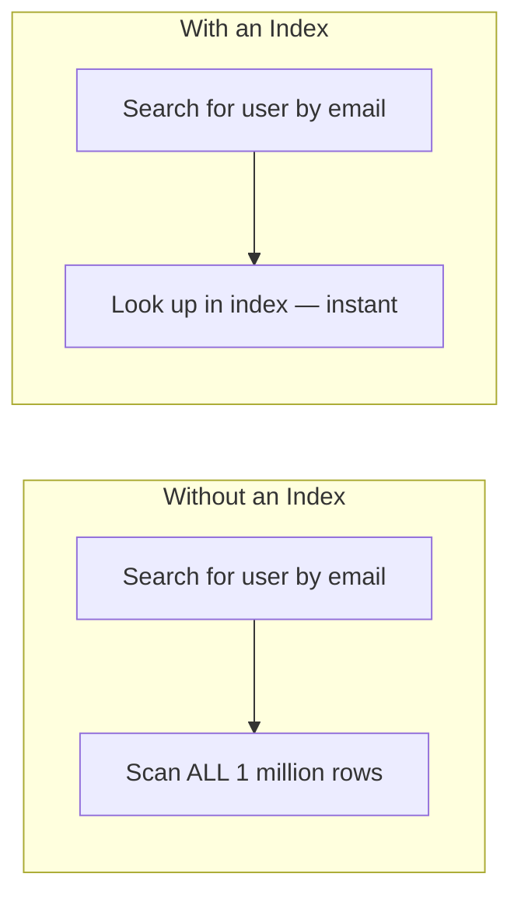

### Key words in simple terms
- **[Index](https://lnkd.in/g_-bQWtA)**: a shortcut list that helps the database find data fast, like the index at the back of a book.
- **[Transaction / ACID](https://lnkd.in/dB3QHiMz)**: a group of steps that must all succeed together, or none happen at all. *Example: moving money from Account A to Account B — you never want money to disappear if the app crashes mid-transfer.*
- **Replication**: keeping copies of your data on other machines, so if one machine dies, you don't lose data.
- **[Sharding](https://lnkd.in/g9mc-d5m)**: splitting a huge dataset across many machines, because one machine can't hold it all.

### 🎥 Video tutorial
- Search YouTube for **"Learn Databases In-Depth – freeCodeCamp"** (4-hour full course covering transactions, indexing, and storage engines).
- Also great: search **"Database Indexing Explained (with PostgreSQL) – Hussein Nasser"** for a focused 15-minute video on indexing specifically.

### 📚 Blog resources
- **SQL vs NoSQL**: https://lnkd.in/gHyC9qWc
- **ACID Transactions**: https://lnkd.in/dB3QHiMz
- **Database Indexes**: https://lnkd.in/g_-bQWtA
- **Database Sharding**: https://lnkd.in/g9mc-d5m
- **CDC (Change Data Capture)**: https://lnkd.in/gWhGwh9Z

### 🛠️ Hands-on task
1. Install Postgres locally (or use a free online sandbox like [db-fiddle.com](https://www.db-fiddle.com)).
2. Create a table with 10,000 rows of fake data.
3. Run `EXPLAIN ANALYZE SELECT * FROM your_table WHERE email = 'test@test.com';` — note the time.
4. Add an index: `CREATE INDEX idx_email ON your_table(email);`
5. Run the same query again — see the huge time difference.

---

## Module 5: System Design Basics — The Vocabulary of Big Systems

### Simple explanation
This module teaches you the words engineers use when designing large systems — the kind of vocabulary you need in interviews and real architecture discussions.

### Real-life example
**[CAP Theorem](https://lnkd.in/g_tFqJJb)** is the big one. Imagine WhatsApp has two servers in two different cities, and the network cable between the cities is cut (a "partition"). Now WhatsApp has to choose:
- **Option A (Consistency)**: stop responding until the cities can talk again, so no messages are lost or out of order.
- **Option B (Availability)**: keep working on both sides, even if the message history might briefly be slightly different in each city.

Most real apps (like WhatsApp, Instagram) choose Option B — a little staleness is fine, but total downtime is not.

### Diagram: the CAP theorem triangle
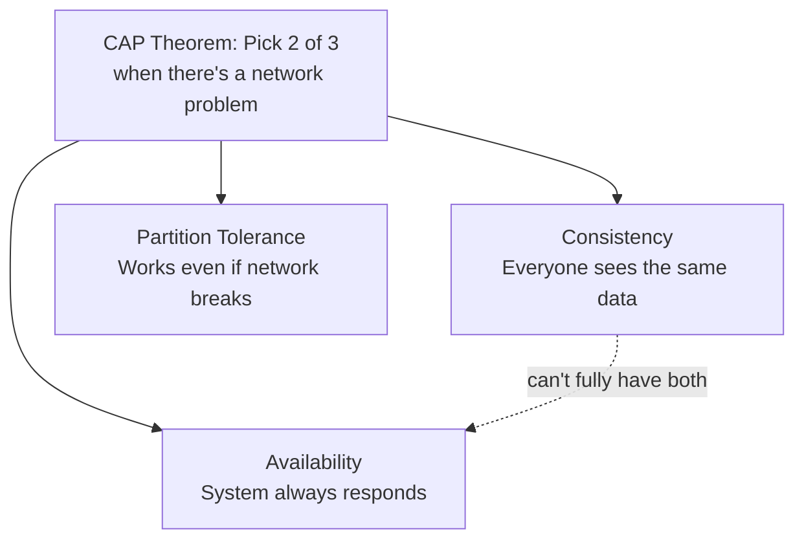

### Key words in simple terms
- **[Scalability](https://lnkd.in/gPGhW-qK) / Horizontal scaling**: add more machines (like adding more cashiers at a store).
- **Vertical scaling**: make one machine bigger and stronger (like giving one cashier superpowers).
- **[Stateless vs Stateful Architecture](https://lnkd.in/gz_ccK-Y)**: a stateless service doesn't remember you between requests — any server can handle any request. Easy to scale.
- **[Availability](https://lnkd.in/gQk2p4_6)**: the system keeps responding even when parts fail — no total downtime for users.
- **[SPOF (Single Point of Failure)](https://lnkd.in/gw_uHZWn)**: one component that, if it dies, takes the whole system down — always design to eliminate these.
- **[Strong vs Eventual Consistency](https://lnkd.in/gCc5cNdE)**: data will be correct "eventually," but maybe not the exact second you wrote it.

### 🎥 Video tutorials
- **Gaurav Sen's full System Design playlist** (start from video 1 and go in order): https://www.youtube.com/playlist?list=PLMCXHnjXnTnvo6alSjVkgxV-VH6EPyvoX
- **CAP Theorem explained simply**: https://www.youtube.com/watch?v=prUs7I-TIMw

### 📚 Blog resources
- **Scalability**: https://lnkd.in/gPGhW-qK
- **Availability**: https://lnkd.in/gQk2p4_6
- **SPOF (Single Point of Failure)**: https://lnkd.in/gw_uHZWn
- **CAP Theorem**: https://lnkd.in/g_tFqJJb
- **Strong vs Eventual Consistency**: https://lnkd.in/gCc5cNdE
- **Stateful vs Stateless Architecture**: https://lnkd.in/gz_ccK-Y

### 🛠️ Hands-on task
1. Draw (on paper or in a tool like Excalidraw) a simple design for "a URL shortener" (like bit.ly): one API server, one database, one cache.
2. Label which parts would need to scale horizontally if traffic grew 100x.
3. Ask yourself: "If my database goes down for 1 minute, what happens to users?" Write your answer down — that's you practicing system design thinking.

---

## Module 6: Distributed Systems Concepts — When You Have Many Machines

### Simple explanation
Once your app runs on more than one machine, new problems appear: machines can crash, network calls can fail halfway, and two machines might disagree about the truth. This module is about handling those problems gracefully.

### Real-life example
**Circuit Breaker** — imagine you keep calling a friend who never picks up. After 5 failed calls, you stop calling for a while instead of wasting your time — you "give the friend a break." Netflix does exactly this: if a service is failing repeatedly, they stop hammering it with more requests, which protects the whole system from crashing.

### Diagram: retry + circuit breaker in action
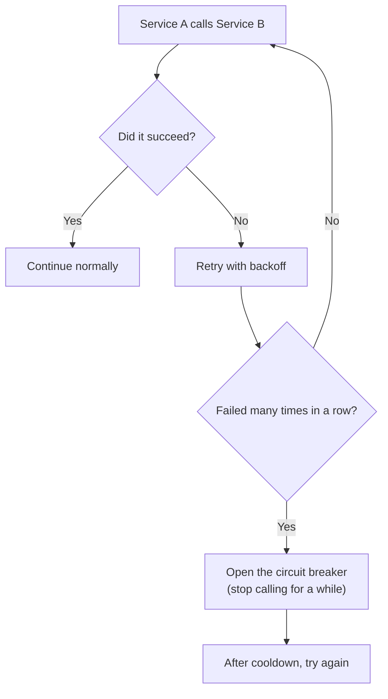

### Diagram: leader-follower replication
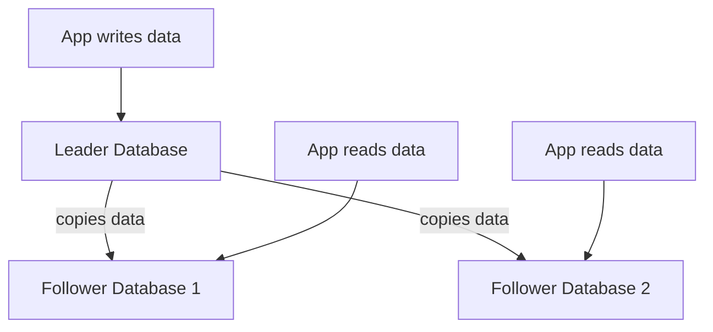

### Key words in simple terms
- **[Idempotency](https://lnkd.in/gDB3AJij)**: doing something twice has the same effect as doing it once. *Example: Stripe payment API — if your app accidentally sends the same "charge $10" request twice due to a network glitch, idempotency keys make sure the customer is only charged once.*
- **Consensus (Raft/Paxos)**: how multiple machines agree on one answer, even if some of them fail. Kubernetes uses this (via etcd) to keep track of what's running in your cluster.
- **Saga pattern**: breaking one big multi-step transaction (like "book flight + book hotel + charge card") into smaller steps, with a plan to undo earlier steps if a later one fails.

### 🎥 Video tutorials
- **ByteByteGo YouTube channel** — search "ByteByteGo circuit breaker" or "ByteByteGo consistent hashing": https://www.youtube.com/@ByteByteGo
- **Gaurav Sen — Raft/Consensus explained**: search "Gaurav Sen Raft consensus" on his channel (link above in Module 5).

### 📚 Blog resources
- **Idempotency**: https://lnkd.in/gDB3AJij
- **Consistent Hashing**: https://lnkd.in/gR9wFDpz

### 🛠️ Hands-on task
1. Pick any API you use at work or in a side project.
2. Write a tiny script that calls it, and add: a timeout (fail after 2 seconds), a retry (try 3 times), and a simple backoff (wait longer each time).
3. Bonus: simulate a "circuit breaker" by tracking failures in a counter, and skip calling the API for 30 seconds after 5 failures in a row.

---

## Module 7: Messaging Systems (Kafka & Friends) ⭐ Go Deep Here

*Since you already use Kafka, treat this module as "level up," not "start from zero."*

### Simple explanation
Instead of Service A calling Service B directly (and waiting), Service A can drop a message into a **[message queue](https://lnkd.in/g-jnNGDC)**, and Service B picks it up whenever it's ready. This decouples services — they don't need to be online at the same exact moment.

📖 **Further reading:** [Batch vs Stream Processing](https://lnkd.in/gKtj_qWh) · [CDC (Change Data Capture)](https://lnkd.in/gWhGwh9Z)

### Real-life example
Think of Kafka like a post office with numbered mailboxes (**partitions**). A producer (like an "OrderPlaced" event from your checkout service) drops a letter into a mailbox. Multiple readers (**consumers** — billing, shipping, notifications) can each check their own copy of the mailbox and react independently, without the order service needing to know or care who's listening.

### Diagram: Kafka producer/consumer flow
```mermaid
graph LR
    P[Producer: Order Service] -->|writes event| T["Kafka Topic: orders<br/>(split into partitions)"]
    T --> C1[Consumer: Billing Service]
    T --> C2[Consumer: Shipping Service]
    T --> C3[Consumer: Notification Service]
```

### Key words in simple terms
- **Topic**: a named stream of events (like "orders" or "payments").
- **Partition**: a topic is split into partitions so many consumers can read in parallel. Order is guaranteed *within* one partition, not across the whole topic.
- **Consumer Group**: a team of consumers sharing the work of reading a topic.
- **Offset**: a bookmark — how far a consumer has read, so it can resume after a restart.

### 🎥 Video tutorials
- **Confluent's official "Apache Kafka 101" course** (made by the creators of Kafka's parent company — the most authoritative source): search "Confluent Apache Kafka 101" or visit developer.confluent.io/courses/apache-kafka
- **Apache Kafka Crash Course by Hussein Nasser**: search "Hussein Nasser Kafka Crash Course" on YouTube (short, practical, with a live coding demo).

### 📚 Blog resources
- **Message Queues**: https://lnkd.in/g-jnNGDC
- **Batch vs Stream Processing**: https://lnkd.in/gKtj_qWh
- **CDC (Change Data Capture)**: https://lnkd.in/gWhGwh9Z

### 🛠️ Hands-on task (since you already use Kafka)
1. Take a topic you already use at work. Write down: how many partitions does it have? What key do you use to decide which partition a message goes to?
2. Deliberately think through: "If I double the number of partitions, does my ordering guarantee break?" (Hint: yes, if you're relying on a global order across the whole topic — this is a very common real production bug.)
3. Try running Kafka locally with Docker (`docker run` a Kafka image), create a topic, and use the CLI to produce and consume a few test messages.

---

## Module 8: Caching — Making Things Fast

### Simple explanation
A **[cache](https://lnkd.in/gBSeTstS)** is a small, fast storage layer that keeps a copy of data you've recently used, so next time you don't have to go all the way to the (slower) database.

📖 **Further reading:** [Caching Strategies](https://lnkd.in/dVk7nZ_Y) · [Cache Eviction Policies](https://lnkd.in/gQAEXEmq) · [CDN](https://lnkd.in/gaW4Vkpy)

### Real-life example
Imagine you're cooking and you keep the salt on the counter instead of walking to the pantry every time. That's a cache — quick access to something you use often. But if someone changes the recipe (the "real" data in the database) and you don't update your counter salt (the cache), you might use the wrong amount — that's a **cache invalidation** bug.

### Diagram: cache-aside pattern
```mermaid
sequenceDiagram
    participant App
    participant Cache as Redis Cache
    participant DB as Database

    App->>Cache: Do you have this data?
    alt Cache has it (cache hit)
        Cache-->>App: Here it is (fast!)
    else Cache doesn't have it (cache miss)
        Cache-->>App: No, I don't have it
        App->>DB: Give me the data
        DB-->>App: Here it is
        App->>Cache: Save it for next time
    end
```

### Key words in simple terms
- **TTL (Time To Live)**: how long a cached item stays valid before it expires automatically. *Example: cache a product price for 60 seconds — good enough freshness without extra complexity.*
- **Cache-aside**: the app checks the cache first, and only asks the database if the cache doesn't have the answer (most common pattern).

### 🎥 Video tutorial
- Search YouTube for **"Redis caching strategies explained"** or **"Hussein Nasser caching"** for practical, backend-focused explanations.

### 📚 Blog resources
- **Caching**: https://lnkd.in/gBSeTstS
- **Caching Strategies**: https://lnkd.in/dVk7nZ_Y
- **Cache Eviction Policies**: https://lnkd.in/gQAEXEmq
- **CDN**: https://lnkd.in/gaW4Vkpy

### 🛠️ Hands-on task
1. Install Redis locally (or use a free Redis cloud sandbox).
2. Write a tiny script: on each request, check Redis first; if missing, "fetch" from a fake slow database (add a 2-second `sleep`), then save the result into Redis with a 30-second TTL.
3. Call it twice in a row and time both calls — see the speed difference on the second call.

---

## Module 9: Containers (Docker) — Packaging Your App

### Simple explanation
Docker packs your app and everything it needs (code, libraries, settings) into one box called a **container**, so it runs the same way on your laptop, in testing, and in production.

### Real-life example
It's like a meal-kit box. Instead of telling someone "buy these 10 ingredients, chop them this way, cook at this temperature" (which can go wrong in many ways), you just hand them a sealed box with everything already measured and ready — they just "run" it.

### Diagram: Docker vs a Virtual Machine
```mermaid
graph TD
    subgraph "Virtual Machines (heavier)"
    H1[Physical Server] --> HV[Hypervisor]
    HV --> VM1[Full VM 1: own OS + App]
    HV --> VM2[Full VM 2: own OS + App]
    end
    subgraph "Docker Containers (lighter)"
    H2[Physical Server] --> OS[One shared OS Kernel]
    OS --> C1[Container 1: App only]
    OS --> C2[Container 2: App only]
    end
```

### Key words in simple terms
- **Image**: the blueprint/template for a container (built from a `Dockerfile`).
- **Container**: a running instance of an image.
- **Volume**: a way to save data outside the container, so it's not lost when the container restarts.

### 🎥 Video tutorial
- **Docker Tutorial for Beginners [FULL COURSE in 3 Hours]** by TechWorld with Nana: https://www.youtube.com/watch?v=3c-iBn73dDE

### 🛠️ Hands-on task
1. Install Docker Desktop.
2. Write a simple `Dockerfile` for a small app (even a "Hello World" Node.js or Python app).
3. Build it: `docker build -t my-first-app .`
4. Run it: `docker run -p 3000:3000 my-first-app`
5. Bonus: use `docker-compose` to run your app together with a Postgres or Redis container.

---

## Module 10: Kubernetes — Managing Many Containers ⭐ Go Deep Here

*You already have some Kubernetes experience — use this module to fill gaps, not to start over.*

### Simple explanation
If Docker gives you one container, Kubernetes is the manager that runs hundreds of containers across many machines, restarts them if they crash, and spreads traffic between them — automatically.

### Real-life example
Think of Kubernetes as an airport's air traffic control system. It doesn't fly the planes (containers) itself, but it decides which runway (machine/node) each plane uses, reroutes flights if a runway closes, and adds more flights when there's more demand (auto-scaling).

### Diagram: basic Kubernetes architecture
```mermaid
graph TD
    U[You: kubectl apply] --> CP[Control Plane]
    CP --> N1[Node 1]
    CP --> N2[Node 2]
    N1 --> P1[Pod: App container]
    N1 --> P2[Pod: App container]
    N2 --> P3[Pod: App container]
    SVC[Service — stable address] --> P1
    SVC --> P2
    SVC --> P3
    Users[Users' traffic] --> ING[Ingress] --> SVC
```

### Key words in simple terms
- **Pod**: the smallest unit — usually one container (sometimes a couple that work closely together).
- **Deployment**: tells Kubernetes "keep 5 copies of this app running at all times."
- **Service**: a stable address that always points to healthy pods, even as pods get replaced.
- **HPA (auto-scaler)**: automatically adds more pods when traffic increases, and removes them when it drops.

### 🎥 Video tutorial
- **Kubernetes Tutorial for Beginners [FULL COURSE in 4 Hours]** by TechWorld with Nana: https://www.youtube.com/watch?v=X48VuDVv0do

### 🛠️ Hands-on task (deepen your existing knowledge)
1. Install Minikube (a mini local Kubernetes) if you don't already run K8s locally.
2. Deploy a simple app with a `Deployment` and a `Service`.
3. Kill one of the pods manually (`kubectl delete pod <name>`) and watch Kubernetes automatically bring up a new one.
4. Set up an HPA and load-test your app to watch it scale up pods in real time.

---

## Module 11: Cloud (AWS) — Renting Computers the Smart Way

### Simple explanation
Instead of buying and maintaining physical servers, you "rent" computing power, storage, and services from AWS (or GCP/Azure), and pay only for what you use.

### Real-life example
It's like renting a car instead of buying one. If you only drive occasionally, renting (cloud) is cheaper and easier than owning, maintaining, and parking a car (a physical server) all the time.

### Diagram: a simple AWS web app setup
```mermaid
graph TD
    Users --> R53[Route53: DNS]
    R53 --> ELB[Load Balancer]
    ELB --> EC2a[EC2 instance 1]
    ELB --> EC2b[EC2 instance 2]
    EC2a --> RDS[(RDS: Managed Database)]
    EC2b --> RDS
    EC2a --> S3[(S3: File Storage)]
```

### Key words in simple terms
- **EC2**: a virtual computer you rent by the hour/second.
- **S3**: cloud storage for files (like a giant, reliable hard drive in the sky).
- **RDS**: a managed database — AWS handles backups, patching, and maintenance for you.
- **IAM**: the permission system — decides who/what is allowed to do what in your AWS account.

### 🎥 Video tutorial
- Search YouTube for **"AWS Certified Cloud Practitioner freeCodeCamp full course"** — a full, free walkthrough of EC2, S3, RDS, and IAM basics.
- AWS's own free training: search **"AWS Skill Builder free digital training"**.

### 🛠️ Hands-on task
1. Sign up for AWS Free Tier (no cost for small usage).
2. Launch a small EC2 instance and SSH into it.
3. Create an S3 bucket and upload a file to it using the AWS CLI.
4. **Important:** shut down/delete resources when done, so you don't get charged.

---

## Module 12: Observability — Seeing What's Happening Inside Your System

### Simple explanation
When your app is spread across many services, you can't just "look at it" to know what's wrong. Observability tools let you see logs, numbers (metrics), and the path of a single request (tracing) across all your services.

### Real-life example
Imagine ordering food through an app: order placed → restaurant confirms → rider picks up → delivered. If it's taking too long, you want to see exactly which step is slow — that's what **tracing** does for a backend request moving through many microservices.

### Diagram: the three pillars of observability
```mermaid
graph TD
    O[Observability] --> L["Logs<br/>(what happened — text records)"]
    O --> M["Metrics<br/>(numbers over time — CPU, errors, latency)"]
    O --> T["Tracing<br/>(the path one request took across services)"]
```

### Key words in simple terms
- **Logs**: text messages your app writes when something happens (`"User 123 logged in"`).
- **Metrics**: numbers tracked over time, shown on dashboards (like error rate per minute).
- **Tracing**: follows one single request as it hops through multiple services, showing you exactly where time was spent.

### 🎥 Video tutorial
- Search YouTube for **"Prometheus Grafana tutorial for beginners"** — most cover setting up dashboards from scratch.
- **TechWorld with Nana** has specific videos on Prometheus monitoring inside Kubernetes — search "TechWorld with Nana Prometheus Kubernetes."

### 🛠️ Hands-on task
1. Run Prometheus and Grafana locally using Docker Compose (many ready-made templates exist online — search "Prometheus Grafana docker-compose example").
2. Point Prometheus at a simple app that exposes a `/metrics` endpoint.
3. Build one Grafana dashboard panel showing request count over time.

---

## Module 13: API Design — How Services Talk to Clients

### Simple explanation
An **[API](https://lnkd.in/dsbwPZ6N)** is the "menu" your service offers to the outside world — what data can be requested, and how.

### Real-life example
**REST** is like a restaurant menu — fixed dishes (endpoints), you order what's on the menu. **[GraphQL](https://lnkd.in/gM5VHKQS)** is more like a buffet — you pick exactly the ingredients (fields) you want, nothing more, nothing less, in one trip. Facebook built GraphQL because their mobile app was making too many separate "menu orders" (REST calls) per screen.

### Diagram: REST vs GraphQL
```mermaid
graph LR
    subgraph "REST — multiple calls"
    A1[GET /user/1] --> R1[user info]
    A2[GET /user/1/posts] --> R2[posts]
    A3[GET /user/1/friends] --> R3[friends]
    end
    subgraph "GraphQL — one call"
    B1["POST /graphql<br/>ask for exactly: name, posts, friends"] --> R4[everything in one response]
    end
```

### Key words in simple terms
- **[JWT](https://lnkd.in/ghtXYRqU)**: a signed token that proves who you are, without the server needing to check a database every time.
- **OAuth**: lets you log into an app using your Google/Facebook account, without giving that app your password.
- **[Rate Limiting](https://lnkd.in/gYDxg8XY)**: capping how many requests one user/client can make, to prevent abuse.
- **[Webhooks](https://lnkd.in/geHxGX-7)**: your server registers a callback URL; when an event happens elsewhere (e.g. a payment succeeds), the other service POSTs to your URL automatically — push instead of poll.

### 🎥 Video tutorial
- Search YouTube for **"REST API design freeCodeCamp full course"**.
- **ByteByteGo** channel has short, visual videos comparing REST vs GraphQL vs gRPC and explaining JWT/OAuth flows: https://www.youtube.com/@ByteByteGo

### 📚 Blog resources
- **APIs**: https://lnkd.in/dsbwPZ6N
- **JWTs**: https://lnkd.in/ghtXYRqU
- **Webhooks**: https://lnkd.in/geHxGX-7
- **Rate Limiting Algorithms**: https://lnkd.in/gYDxg8XY
- **REST vs GraphQL**: https://lnkd.in/gM5VHKQS
- **API Gateways**: https://lnkd.in/gtyXmvf4

### 🛠️ Hands-on task
1. Build a tiny REST API with 3 endpoints (`GET /users`, `GET /users/:id`, `POST /users`).
2. Add a simple rate limiter (e.g., max 5 requests per minute per IP) using a library or a Redis counter.
3. Add JWT-based login: issue a token on login, and require it on the other endpoints.

---

## Module 14: Security — Protecting Your System

### Simple explanation
Security is about making sure only the right people/services can access your data, and that data can't be read or changed by attackers along the way.

### Real-life example
TLS (HTTPS) is like sending a letter in a locked box that only the receiver has the key to — even if someone intercepts it in the mail, they can't read it. A leaked API key is like leaving your house key under the doormat — convenient, but anyone who finds it can walk right in. This is why real companies use secret managers (like AWS Secrets Manager) instead of hardcoding passwords in code.

### Diagram: secrets management flow
```mermaid
flowchart LR
    A[Your App starts up] --> B[Ask Secrets Manager for DB password]
    B --> C{Is the app allowed?}
    C -- Yes --> D[Give the password securely]
    C -- No --> E[Deny access]
    D --> F[App connects to Database]
```

### Key words in simple terms
- **TLS**: encrypts data while it travels over the network.
- **Encryption at rest**: encrypts data while it's stored on disk (e.g., encrypted S3 buckets).
- **Least privilege**: give every person/service only the exact permissions they need, nothing more.

### 🎥 Video tutorial
- Search YouTube for **"OWASP Top 10 explained"** and **"JWT security mistakes"** for practical, real-world security lessons.

### 📚 Blog resources
- **JWTs**: https://lnkd.in/ghtXYRqU

### 🛠️ Hands-on task
1. Look at any project you've built — search your code for hardcoded passwords or API keys.
2. Move them into environment variables (a small first step toward proper secrets management).
3. If you use AWS, try creating one IAM user with permission to access only ONE specific S3 bucket — practice least privilege.

---

## Module 15: Architecture Patterns — Common Ways to Structure Big Systems

### Simple explanation
These are proven "recipes" engineers use again and again to structure large systems, instead of inventing a new approach every time.

### Real-life example
**Microservices** — Netflix doesn't have one giant program. It has hundreds of small, independent services (one for billing, one for recommendations, one for video streaming), each built and deployed by a different small team. If the recommendations service crashes, you can still watch a movie — that's the benefit of splitting things up.

### Diagram: monolith vs microservices
```mermaid
graph TD
    subgraph "Monolith — one big app"
    M[Single App: Users + Orders + Payments + Shipping]
    end
    subgraph "Microservices — many small apps"
    S1[Users Service]
    S2[Orders Service]
    S3[Payments Service]
    S4[Shipping Service]
    S1 --- S2
    S2 --- S3
    S3 --- S4
    end
```

### Key words in simple terms
- **Event-driven architecture**: services react to events instead of calling each other directly (uses message queues like Kafka).
- **[API Gateway](https://lnkd.in/gtyXmvf4)**: one "front door" that routes traffic to the right microservice — like a hotel receptionist directing guests to the right room.
- **Outbox pattern**: makes sure that when you save something to the database AND publish an event about it, both things happen together reliably (a very common real-world bug source when done wrong).

### 🎥 Video tutorial
- **ByteByteGo** channel: search "ByteByteGo microservices" or "ByteByteGo event-driven architecture": https://www.youtube.com/@ByteByteGo
- **CodeOpinion** channel: search "CodeOpinion outbox pattern" for a focused, practical explanation.

### 📚 Blog resources
- **API Gateways**: https://lnkd.in/gtyXmvf4
- **Stateful vs Stateless Architecture**: https://lnkd.in/gz_ccK-Y

### 🛠️ Hands-on task
1. Take one feature from a monolith app you've worked on (or a sample project) and sketch how you'd split it into 2-3 microservices.
2. Decide: which service owns which data? How would they talk to each other — direct API calls, or events through a queue?

---

## Module 16: Algorithms Used in Distributed Systems

### Simple explanation
These are clever tricks that make distributed systems fast and reliable, even with huge amounts of data spread across many machines.

### Real-life example
**[Consistent Hashing](https://lnkd.in/gR9wFDpz)** solves a real problem: imagine you have 10 servers storing cached data, split by `hash(key) % 10`. If you add an 11th server, almost ALL your data suddenly maps to a different server — a disaster. Consistent hashing (used by Amazon's Dynamo, and later Cassandra and DynamoDB) fixes this so adding/removing one server only moves a small slice of data, not everything.

### Diagram: consistent hashing ring
```mermaid
graph TD
    Ring["Hash Ring (0 to 360°)"]
    Ring --> N1[Server A at 30°]
    Ring --> N2[Server B at 150°]
    Ring --> N3[Server C at 270°]
    K1["Key 'user123' hashes to 100°<br/>→ goes to next server clockwise: Server B"]
```

### Key words in simple terms
- **[Bloom Filter](https://lnkd.in/gfGjCrSZ)**: a tiny, super-fast "maybe yes / definitely no" checker. *Example: Cassandra uses it to quickly check "does this key possibly exist on disk?" before doing an expensive disk read.*
- **Gossip Protocol**: instead of one central manager, nodes randomly tell a few neighbors "here's my status," and information spreads across the whole cluster over time — like rumors spreading in a school.
- **Distributed Lock**: making sure only ONE server does a specific job at a time, even though many servers could try. *Example: making sure only one instance of a scheduled nightly job actually runs, even if you have 5 copies of your app deployed.*

### 🎥 Video tutorial
- **Gaurav Sen** channel: search "Gaurav Sen consistent hashing" and "Gaurav Sen bloom filter" for focused whiteboard explanations.

### 📚 Blog resources
- **Consistent Hashing**: https://lnkd.in/gR9wFDpz
- **Bloom Filters**: https://lnkd.in/gfGjCrSZ

### 🛠️ Hands-on task
1. On paper, draw a hash ring with 4 servers.
2. Manually place 5 sample keys on the ring and figure out which server each belongs to.
3. Now remove one server — figure out which keys have to move. Notice it's only some keys, not all of them — that's the whole point of consistent hashing.

---

## Suggested Study Order

1. Networking → 2. Operating Systems → 3. Linux → 4. Databases → 5. System Design Basics → 6. Distributed Systems Concepts → 7. Messaging Systems → 8. Caching → 9. Containers → 10. Kubernetes → 11. Cloud → 12. Observability → 13. API Design → 14. Security → 15. Architecture Patterns → 16. Algorithms

**Reminder:** Modules 7 (Kafka) and 10 (Kubernetes) are areas to go deeper on, since you already have experience there. Don't just watch the videos — do the hands-on tasks and try to break things on purpose, then fix them. That's how real understanding sticks.

**A note on the video links:** direct video links can sometimes go offline or get replaced by a newer version. If a link doesn't work, just search the video title (given right above each link) on YouTube — it will almost always still be there under the same name, or a newer, updated version will show up.