# Backend & Distributed Systems Course — Easy Edition

This is a beginner-friendly version of the course. It uses simple English, real-life examples, pictures (diagrams), video tutorials, and hands-on practice for every module. You don't need to be an expert to start — just basic backend knowledge (you can build a simple API and use a database).

**How to use this course:** For each module — read the simple explanation, look at the diagram, watch the video, then do the hands-on task. Don't skip the hands-on part. Reading is not the same as doing.

---

## Module 1: Networking — How Computers Talk to Each Other

### Simple explanation
When you open a website, your computer (client) sends a message to another computer (server) somewhere else in the world, and gets a message back. Networking is the set of rules that make this possible — like a shared language both computers understand.

### Real-life example
Think of it like sending a letter. You write an address (like an IP address), put your letter in an envelope (like a data packet), and the postal system (the network) delivers it. If the letter is important (like a bank transfer), you want proof it arrived — that's TCP. If it's just casual news, you don't care if it's a bit late or lost — that's UDP (used in video calls, so a lost frame is not a big deal).

### Diagram: how a web request travels
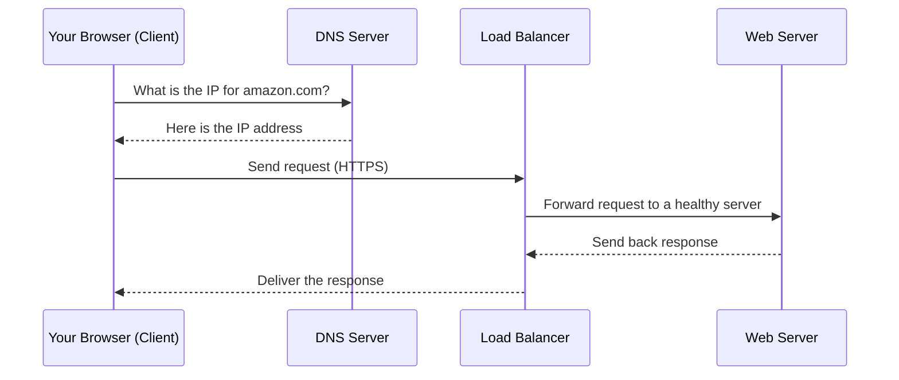

### Key words in simple terms
- **HTTP/HTTPS**: the language browsers and servers use to talk. HTTPS is the same, but locked with a secret code (encryption).
- **TCP vs UDP**: TCP = reliable but a bit slower (used for websites, apps). UDP = fast but can lose data (used for video calls, gaming).
- **Load Balancer**: a traffic cop that sends visitors to different servers, so no single server gets overloaded.
- **DNS**: the phonebook of the internet — turns names like `google.com` into numbers (IP addresses) computers understand.

### 🎥 Video tutorials
- **TCP/IP Made Super Easy for Beginners** (short, very beginner-friendly): https://www.youtube.com/watch?v=LUxeuFz_GQo
- **Zero to Hero: Networking Fundamentals Crash Course**: https://www.youtube.com/watch?v=ltBWJIhcjpA

### 🛠️ Hands-on task
1. Open your terminal and type: `curl -v https://example.com`
2. Look at the output. You'll see the TLS handshake happening, and the actual HTTP request/response headers.
3. Try `ping google.com` and notice the "time=" value — that's the latency (delay) we talked about.

---

## Module 2: Operating Systems — How Your Code Actually Runs

### Simple explanation
Your app doesn't run "by magic" — it runs on a computer, and the Operating System (OS, like Linux or Windows) decides how much CPU time and memory your app gets, and shares the machine between many programs at once.

### Real-life example
Imagine a busy restaurant kitchen with one stove (the CPU) and many chefs (your processes) wanting to cook at the same time. The head chef (the OS scheduler) decides who gets stove time and for how long, quickly switching between dishes so everyone's food gets made, even though only one dish is actually cooking at any exact moment.

### Diagram: process vs thread
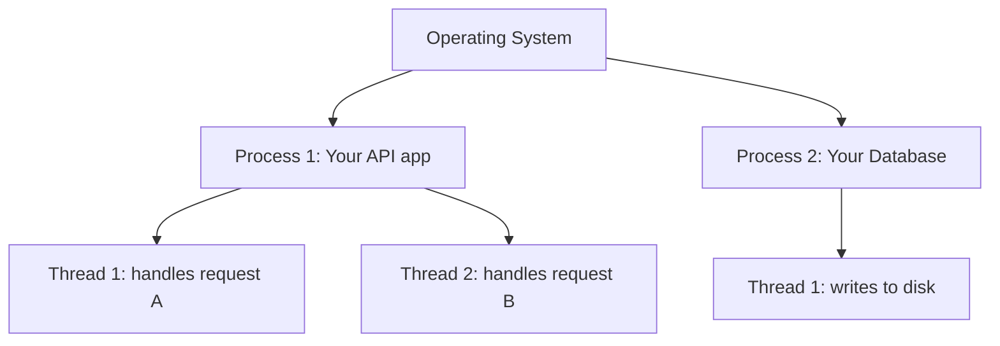

### Key words in simple terms
- **Process**: a running program with its own private memory.
- **Thread**: a smaller worker inside a process; threads in the same process share memory.
- **Deadlock**: two workers stuck waiting for each other forever, like two people trying to pass through a narrow door and both stepping back to let the other go first — forever.
- **Memory Management**: how the OS gives out and takes back RAM. A "memory leak" is when your app keeps asking for memory and never gives it back, until the machine runs out.

### 🎥 Video tutorial
- **Operating Systems – Comprehensive Course for Beginners** (freeCodeCamp, 25 hours — you don't have to watch it all, just the sections you need): https://www.youtube.com/watch?v=yK1uBHPdp30

### 🛠️ Hands-on task
1. Run `top` (or `htop` if installed) on your machine while your app is running.
2. Watch the CPU% and MEM% columns change as you send requests to your app.
3. Try opening 100 terminal tabs (or a small script that spawns many processes) and see your machine slow down — that's context-switching overhead in action.

---

## Module 3: Linux — The Operating System Behind Almost Every Server

### Simple explanation
Nearly every server in the world (AWS, Google Cloud, your company's backend) runs Linux. Learning basic Linux commands is like learning to drive — you need it to operate anything in production.

### Real-life example
When something breaks in production at 2 AM, you SSH (remotely log in) into the server and use Linux commands to find out what's wrong — checking logs, checking if the app is running, checking disk space.

### Diagram: a typical debugging flow
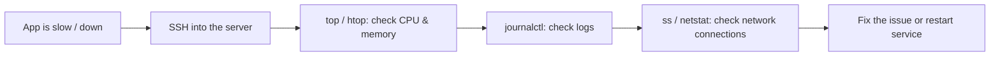

### Key words in simple terms
- **Bash**: the command language you type into the terminal.
- **SSH**: a secure way to remotely log into another computer.
- **Cron**: a built-in scheduler — like an alarm clock for scripts ("run this backup every night at 2 AM").
- **systemd**: keeps your service running — if it crashes, systemd can restart it automatically.

### 🎥 Video tutorial
- **Introduction to Linux – Full Course for Beginners** (freeCodeCamp, Linux Foundation): https://www.youtube.com/playlist?list=PLHbN2j-imEXa7fiBlASvpQRSpWclPg1DH

### 🛠️ Hands-on task
1. If you don't already have one, spin up a free-tier Linux server (AWS EC2 free tier, or just use a virtual machine).
2. Practice these commands: `ls`, `cd`, `cat`, `top`, `ss -tulpn`, `journalctl -xe`.
3. Write a small bash script that prints "Hello World," then schedule it to run every minute using `cron` (`crontab -e`).

---

## Module 4: Databases — Where Your Data Lives

### Simple explanation
A database is where your app's data (users, orders, messages) is stored safely, so it's still there after your app restarts. Different databases are good at different things — some are great for structured data (SQL), some for flexible or huge-scale data (NoSQL).

### Real-life example
Think of a SQL database (like Postgres) as a well-organized filing cabinet with labeled folders — great when your data has a clear structure (like customer records). Think of a NoSQL database (like MongoDB) as a big box where you can just throw in documents of different shapes — more flexible, but less strict.

### Diagram: how an index speeds up search
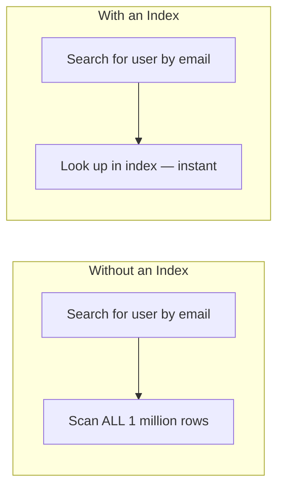

### Key words in simple terms
- **Index**: a shortcut list that helps the database find data fast, like the index at the back of a book.
- **Transaction**: a group of steps that must all succeed together, or none happen at all. *Example: moving money from Account A to Account B — you never want money to disappear if the app crashes mid-transfer.*
- **Replication**: keeping copies of your data on other machines, so if one machine dies, you don't lose data.
- **Sharding**: splitting a huge dataset across many machines, because one machine can't hold it all.

### 🎥 Video tutorial
- Search YouTube for **"Learn Databases In-Depth – freeCodeCamp"** (4-hour full course covering transactions, indexing, and storage engines).
- Also great: search **"Database Indexing Explained (with PostgreSQL) – Hussein Nasser"** for a focused 15-minute video on indexing specifically.

### 🛠️ Hands-on task
1. Install Postgres locally (or use a free online sandbox like [db-fiddle.com](https://www.db-fiddle.com)).
2. Create a table with 10,000 rows of fake data.
3. Run `EXPLAIN ANALYZE SELECT * FROM your_table WHERE email = 'test@test.com';` — note the time.
4. Add an index: `CREATE INDEX idx_email ON your_table(email);`
5. Run the same query again — see the huge time difference.

---

## Module 5: System Design Basics — The Vocabulary of Big Systems

### Simple explanation
This module teaches you the words engineers use when designing large systems — the kind of vocabulary you need in interviews and real architecture discussions.

### Real-life example
**CAP Theorem** is the big one. Imagine WhatsApp has two servers in two different cities, and the network cable between the cities is cut (a "partition"). Now WhatsApp has to choose:
- **Option A (Consistency)**: stop responding until the cities can talk again, so no messages are lost or out of order.
- **Option B (Availability)**: keep working on both sides, even if the message history might briefly be slightly different in each city.

Most real apps (like WhatsApp, Instagram) choose Option B — a little staleness is fine, but total downtime is not.

### Diagram: the CAP theorem triangle
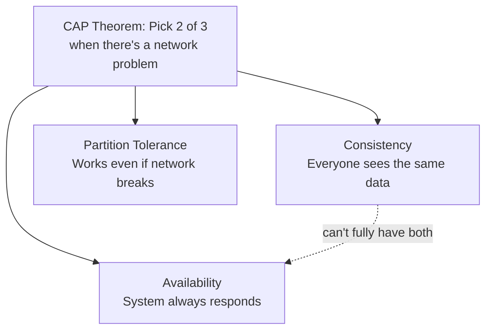

### Key words in simple terms
- **Horizontal scaling**: add more machines (like adding more cashiers at a store).
- **Vertical scaling**: make one machine bigger and stronger (like giving one cashier superpowers).
- **Stateless service**: a server that doesn't remember you between requests — any server can handle any request. Easy to scale.
- **Eventual consistency**: data will be correct "eventually," but maybe not the exact second you wrote it.

### 🎥 Video tutorials
- **Gaurav Sen's full System Design playlist** (start from video 1 and go in order): https://www.youtube.com/playlist?list=PLMCXHnjXnTnvo6alSjVkgxV-VH6EPyvoX
- **CAP Theorem explained simply**: https://www.youtube.com/watch?v=prUs7I-TIMw

### 🛠️ Hands-on task
1. Draw (on paper or in a tool like Excalidraw) a simple design for "a URL shortener" (like bit.ly): one API server, one database, one cache.
2. Label which parts would need to scale horizontally if traffic grew 100x.
3. Ask yourself: "If my database goes down for 1 minute, what happens to users?" Write your answer down — that's you practicing system design thinking.

---

## Module 6: Distributed Systems Concepts — When You Have Many Machines

### Simple explanation
Once your app runs on more than one machine, new problems appear: machines can crash, network calls can fail halfway, and two machines might disagree about the truth. This module is about handling those problems gracefully.

### Real-life example
**Circuit Breaker** — imagine you keep calling a friend who never picks up. After 5 failed calls, you stop calling for a while instead of wasting your time — you "give the friend a break." Netflix does exactly this: if a service is failing repeatedly, they stop hammering it with more requests, which protects the whole system from crashing.

### Diagram: retry + circuit breaker in action
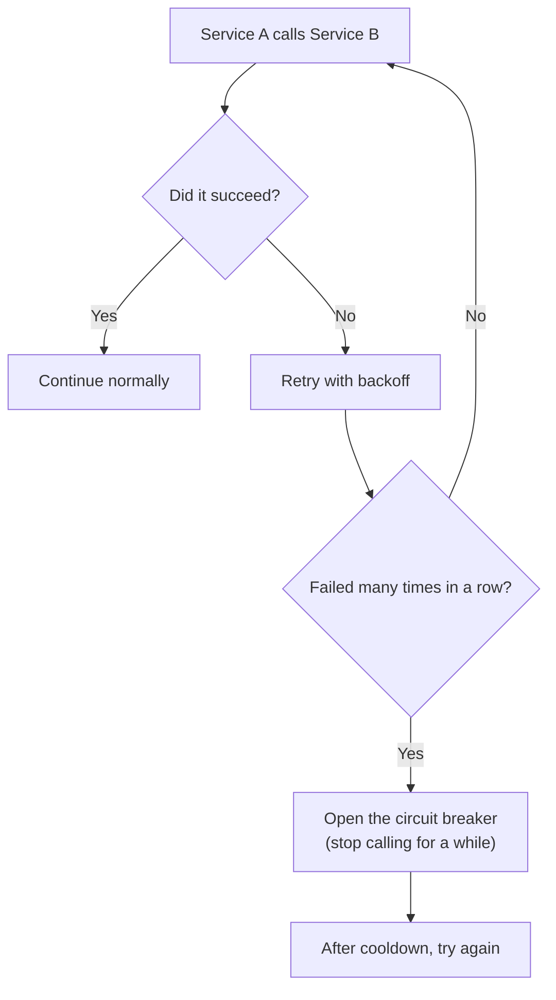

### Diagram: leader-follower replication
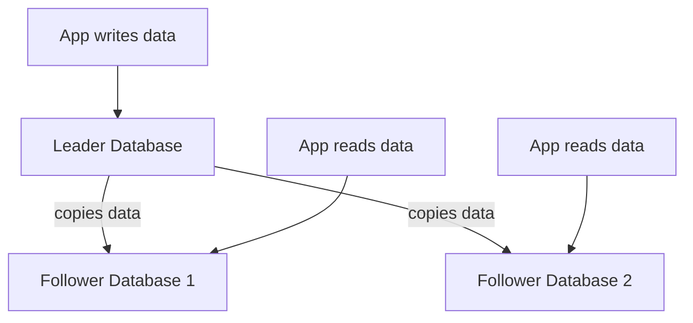

### Key words in simple terms
- **Idempotency**: doing something twice has the same effect as doing it once. *Example: Stripe payment API — if your app accidentally sends the same "charge $10" request twice due to a network glitch, idempotency keys make sure the customer is only charged once.*
- **Consensus (Raft/Paxos)**: how multiple machines agree on one answer, even if some of them fail. Kubernetes uses this (via etcd) to keep track of what's running in your cluster.
- **Saga pattern**: breaking one big multi-step transaction (like "book flight + book hotel + charge card") into smaller steps, with a plan to undo earlier steps if a later one fails.

### 🎥 Video tutorials
- **ByteByteGo YouTube channel** — search "ByteByteGo circuit breaker" or "ByteByteGo consistent hashing": https://www.youtube.com/@ByteByteGo
- **Gaurav Sen — Raft/Consensus explained**: search "Gaurav Sen Raft consensus" on his channel (link above in Module 5).

### 🛠️ Hands-on task
1. Pick any API you use at work or in a side project.
2. Write a tiny script that calls it, and add: a timeout (fail after 2 seconds), a retry (try 3 times), and a simple backoff (wait longer each time).
3. Bonus: simulate a "circuit breaker" by tracking failures in a counter, and skip calling the API for 30 seconds after 5 failures in a row.

---

## Module 7: Messaging Systems (Kafka & Friends) ⭐ Go Deep Here

*Since you already use Kafka, treat this module as "level up," not "start from zero."*

### Simple explanation
Instead of Service A calling Service B directly (and waiting), Service A can drop a message into a queue, and Service B picks it up whenever it's ready. This decouples services — they don't need to be online at the same exact moment.

### Real-life example
Think of Kafka like a post office with numbered mailboxes (**partitions**). A producer (like an "OrderPlaced" event from your checkout service) drops a letter into a mailbox. Multiple readers (**consumers** — billing, shipping, notifications) can each check their own copy of the mailbox and react independently, without the order service needing to know or care who's listening.

### Diagram: Kafka producer/consumer flow
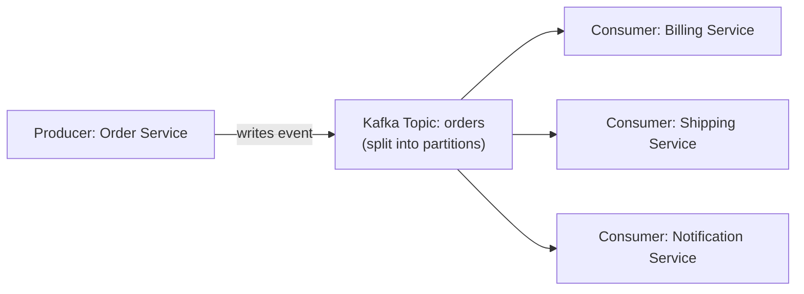

### Key words in simple terms
- **Topic**: a named stream of events (like "orders" or "payments").
- **Partition**: a topic is split into partitions so many consumers can read in parallel. Order is guaranteed *within* one partition, not across the whole topic.
- **Consumer Group**: a team of consumers sharing the work of reading a topic.
- **Offset**: a bookmark — how far a consumer has read, so it can resume after a restart.

### 🎥 Video tutorials
- **Confluent's official "Apache Kafka 101" course** (made by the creators of Kafka's parent company — the most authoritative source): search "Confluent Apache Kafka 101" or visit developer.confluent.io/courses/apache-kafka
- **Apache Kafka Crash Course by Hussein Nasser**: search "Hussein Nasser Kafka Crash Course" on YouTube (short, practical, with a live coding demo).

### 🛠️ Hands-on task (since you already use Kafka)
1. Take a topic you already use at work. Write down: how many partitions does it have? What key do you use to decide which partition a message goes to?
2. Deliberately think through: "If I double the number of partitions, does my ordering guarantee break?" (Hint: yes, if you're relying on a global order across the whole topic — this is a very common real production bug.)
3. Try running Kafka locally with Docker (`docker run` a Kafka image), create a topic, and use the CLI to produce and consume a few test messages.

---

## Module 8: Caching — Making Things Fast

### Simple explanation
A cache is a small, fast storage layer that keeps a copy of data you've recently used, so next time you don't have to go all the way to the (slower) database.

### Real-life example
Imagine you're cooking and you keep the salt on the counter instead of walking to the pantry every time. That's a cache — quick access to something you use often. But if someone changes the recipe (the "real" data in the database) and you don't update your counter salt (the cache), you might use the wrong amount — that's a **cache invalidation** bug.

### Diagram: cache-aside pattern
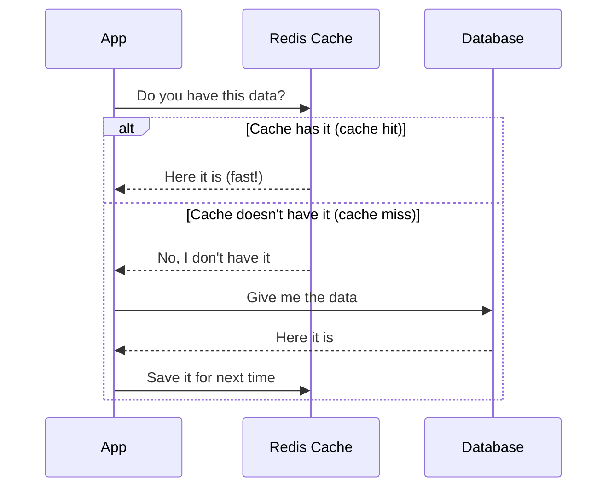

### Key words in simple terms
- **TTL (Time To Live)**: how long a cached item stays valid before it expires automatically. *Example: cache a product price for 60 seconds — good enough freshness without extra complexity.*
- **Cache-aside**: the app checks the cache first, and only asks the database if the cache doesn't have the answer (most common pattern).

### 🎥 Video tutorial
- Search YouTube for **"Redis caching strategies explained"** or **"Hussein Nasser caching"** for practical, backend-focused explanations.

### 🛠️ Hands-on task
1. Install Redis locally (or use a free Redis cloud sandbox).
2. Write a tiny script: on each request, check Redis first; if missing, "fetch" from a fake slow database (add a 2-second `sleep`), then save the result into Redis with a 30-second TTL.
3. Call it twice in a row and time both calls — see the speed difference on the second call.

---

## Module 9: Containers (Docker) — Packaging Your App

### Simple explanation
Docker packs your app and everything it needs (code, libraries, settings) into one box called a **container**, so it runs the same way on your laptop, in testing, and in production.

### Real-life example
It's like a meal-kit box. Instead of telling someone "buy these 10 ingredients, chop them this way, cook at this temperature" (which can go wrong in many ways), you just hand them a sealed box with everything already measured and ready — they just "run" it.

### Diagram: Docker vs a Virtual Machine
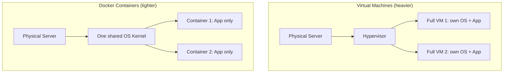

### Key words in simple terms
- **Image**: the blueprint/template for a container (built from a `Dockerfile`).
- **Container**: a running instance of an image.
- **Volume**: a way to save data outside the container, so it's not lost when the container restarts.

### 🎥 Video tutorial
- **Docker Tutorial for Beginners [FULL COURSE in 3 Hours]** by TechWorld with Nana: https://www.youtube.com/watch?v=3c-iBn73dDE

### 🛠️ Hands-on task
1. Install Docker Desktop.
2. Write a simple `Dockerfile` for a small app (even a "Hello World" Node.js or Python app).
3. Build it: `docker build -t my-first-app .`
4. Run it: `docker run -p 3000:3000 my-first-app`
5. Bonus: use `docker-compose` to run your app together with a Postgres or Redis container.

---

## Module 10: Kubernetes — Managing Many Containers ⭐ Go Deep Here

*You already have some Kubernetes experience — use this module to fill gaps, not to start over.*

### Simple explanation
If Docker gives you one container, Kubernetes is the manager that runs hundreds of containers across many machines, restarts them if they crash, and spreads traffic between them — automatically.

### Real-life example
Think of Kubernetes as an airport's air traffic control system. It doesn't fly the planes (containers) itself, but it decides which runway (machine/node) each plane uses, reroutes flights if a runway closes, and adds more flights when there's more demand (auto-scaling).

### Diagram: basic Kubernetes architecture
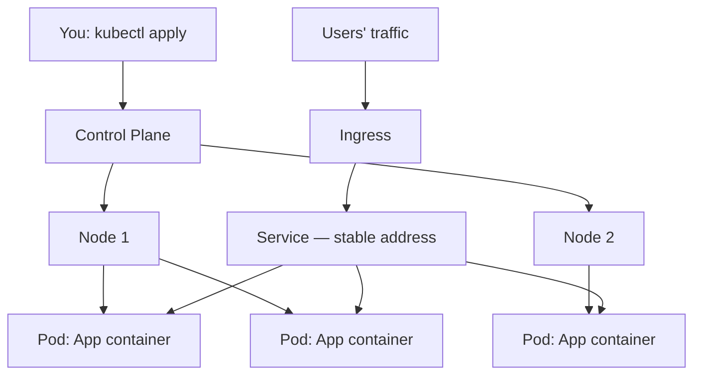

### Key words in simple terms
- **Pod**: the smallest unit — usually one container (sometimes a couple that work closely together).
- **Deployment**: tells Kubernetes "keep 5 copies of this app running at all times."
- **Service**: a stable address that always points to healthy pods, even as pods get replaced.
- **HPA (auto-scaler)**: automatically adds more pods when traffic increases, and removes them when it drops.

### 🎥 Video tutorial
- **Kubernetes Tutorial for Beginners [FULL COURSE in 4 Hours]** by TechWorld with Nana: https://www.youtube.com/watch?v=X48VuDVv0do

### 🛠️ Hands-on task (deepen your existing knowledge)
1. Install Minikube (a mini local Kubernetes) if you don't already run K8s locally.
2. Deploy a simple app with a `Deployment` and a `Service`.
3. Kill one of the pods manually (`kubectl delete pod <name>`) and watch Kubernetes automatically bring up a new one.
4. Set up an HPA and load-test your app to watch it scale up pods in real time.

---

## Module 11: Cloud (AWS) — Renting Computers the Smart Way

### Simple explanation
Instead of buying and maintaining physical servers, you "rent" computing power, storage, and services from AWS (or GCP/Azure), and pay only for what you use.

### Real-life example
It's like renting a car instead of buying one. If you only drive occasionally, renting (cloud) is cheaper and easier than owning, maintaining, and parking a car (a physical server) all the time.

### Diagram: a simple AWS web app setup
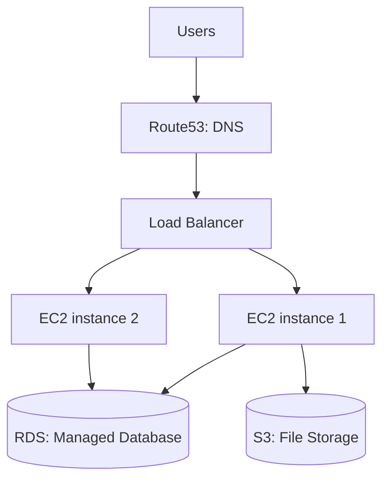

### Key words in simple terms
- **EC2**: a virtual computer you rent by the hour/second.
- **S3**: cloud storage for files (like a giant, reliable hard drive in the sky).
- **RDS**: a managed database — AWS handles backups, patching, and maintenance for you.
- **IAM**: the permission system — decides who/what is allowed to do what in your AWS account.

### 🎥 Video tutorial
- Search YouTube for **"AWS Certified Cloud Practitioner freeCodeCamp full course"** — a full, free walkthrough of EC2, S3, RDS, and IAM basics.
- AWS's own free training: search **"AWS Skill Builder free digital training"**.

### 🛠️ Hands-on task
1. Sign up for AWS Free Tier (no cost for small usage).
2. Launch a small EC2 instance and SSH into it.
3. Create an S3 bucket and upload a file to it using the AWS CLI.
4. **Important:** shut down/delete resources when done, so you don't get charged.

---

## Module 12: Observability — Seeing What's Happening Inside Your System

### Simple explanation
When your app is spread across many services, you can't just "look at it" to know what's wrong. Observability tools let you see logs, numbers (metrics), and the path of a single request (tracing) across all your services.

### Real-life example
Imagine ordering food through an app: order placed → restaurant confirms → rider picks up → delivered. If it's taking too long, you want to see exactly which step is slow — that's what **tracing** does for a backend request moving through many microservices.

### Diagram: the three pillars of observability
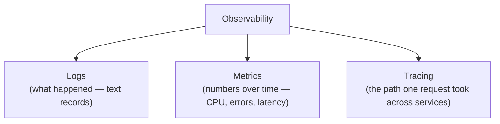

### Key words in simple terms
- **Logs**: text messages your app writes when something happens (`"User 123 logged in"`).
- **Metrics**: numbers tracked over time, shown on dashboards (like error rate per minute).
- **Tracing**: follows one single request as it hops through multiple services, showing you exactly where time was spent.

### 🎥 Video tutorial
- Search YouTube for **"Prometheus Grafana tutorial for beginners"** — most cover setting up dashboards from scratch.
- **TechWorld with Nana** has specific videos on Prometheus monitoring inside Kubernetes — search "TechWorld with Nana Prometheus Kubernetes."

### 🛠️ Hands-on task
1. Run Prometheus and Grafana locally using Docker Compose (many ready-made templates exist online — search "Prometheus Grafana docker-compose example").
2. Point Prometheus at a simple app that exposes a `/metrics` endpoint.
3. Build one Grafana dashboard panel showing request count over time.

---

## Module 13: API Design — How Services Talk to Clients

### Simple explanation
An API is the "menu" your service offers to the outside world — what data can be requested, and how.

### Real-life example
**REST** is like a restaurant menu — fixed dishes (endpoints), you order what's on the menu. **GraphQL** is more like a buffet — you pick exactly the ingredients (fields) you want, nothing more, nothing less, in one trip. Facebook built GraphQL because their mobile app was making too many separate "menu orders" (REST calls) per screen.

### Diagram: REST vs GraphQL
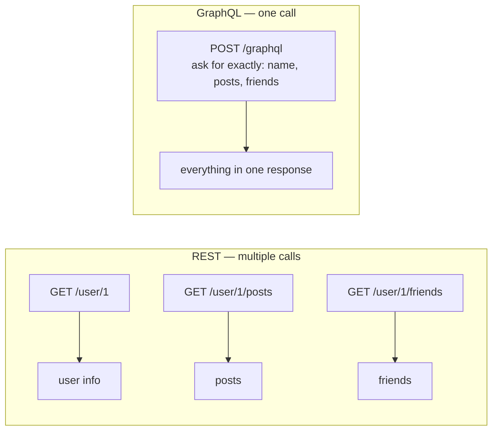

### Key words in simple terms
- **JWT**: a signed token that proves who you are, without the server needing to check a database every time.
- **OAuth**: lets you log into an app using your Google/Facebook account, without giving that app your password.
- **Rate limiting**: capping how many requests one user/client can make, to prevent abuse.

### 🎥 Video tutorial
- Search YouTube for **"REST API design freeCodeCamp full course"**.
- **ByteByteGo** channel has short, visual videos comparing REST vs GraphQL vs gRPC and explaining JWT/OAuth flows: https://www.youtube.com/@ByteByteGo

### 🛠️ Hands-on task
1. Build a tiny REST API with 3 endpoints (`GET /users`, `GET /users/:id`, `POST /users`).
2. Add a simple rate limiter (e.g., max 5 requests per minute per IP) using a library or a Redis counter.
3. Add JWT-based login: issue a token on login, and require it on the other endpoints.

---

## Module 14: Security — Protecting Your System

### Simple explanation
Security is about making sure only the right people/services can access your data, and that data can't be read or changed by attackers along the way.

### Real-life example
TLS (HTTPS) is like sending a letter in a locked box that only the receiver has the key to — even if someone intercepts it in the mail, they can't read it. A leaked API key is like leaving your house key under the doormat — convenient, but anyone who finds it can walk right in. This is why real companies use secret managers (like AWS Secrets Manager) instead of hardcoding passwords in code.

### Diagram: secrets management flow
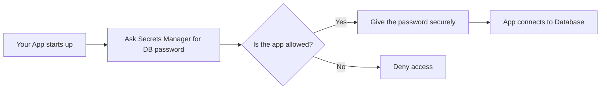

### Key words in simple terms
- **TLS**: encrypts data while it travels over the network.
- **Encryption at rest**: encrypts data while it's stored on disk (e.g., encrypted S3 buckets).
- **Least privilege**: give every person/service only the exact permissions they need, nothing more.

### 🎥 Video tutorial
- Search YouTube for **"OWASP Top 10 explained"** and **"JWT security mistakes"** for practical, real-world security lessons.

### 🛠️ Hands-on task
1. Look at any project you've built — search your code for hardcoded passwords or API keys.
2. Move them into environment variables (a small first step toward proper secrets management).
3. If you use AWS, try creating one IAM user with permission to access only ONE specific S3 bucket — practice least privilege.

---

## Module 15: Architecture Patterns — Common Ways to Structure Big Systems

### Simple explanation
These are proven "recipes" engineers use again and again to structure large systems, instead of inventing a new approach every time.

### Real-life example
**Microservices** — Netflix doesn't have one giant program. It has hundreds of small, independent services (one for billing, one for recommendations, one for video streaming), each built and deployed by a different small team. If the recommendations service crashes, you can still watch a movie — that's the benefit of splitting things up.

### Diagram: monolith vs microservices
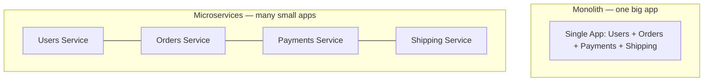

### Key words in simple terms
- **Event-driven architecture**: services react to events instead of calling each other directly (uses message queues like Kafka).
- **API Gateway**: one "front door" that routes traffic to the right microservice — like a hotel receptionist directing guests to the right room.
- **Outbox pattern**: makes sure that when you save something to the database AND publish an event about it, both things happen together reliably (a very common real-world bug source when done wrong).

### 🎥 Video tutorial
- **ByteByteGo** channel: search "ByteByteGo microservices" or "ByteByteGo event-driven architecture": https://www.youtube.com/@ByteByteGo
- **CodeOpinion** channel: search "CodeOpinion outbox pattern" for a focused, practical explanation.

### 🛠️ Hands-on task
1. Take one feature from a monolith app you've worked on (or a sample project) and sketch how you'd split it into 2-3 microservices.
2. Decide: which service owns which data? How would they talk to each other — direct API calls, or events through a queue?

---

## Module 16: Algorithms Used in Distributed Systems

### Simple explanation
These are clever tricks that make distributed systems fast and reliable, even with huge amounts of data spread across many machines.

### Real-life example
**Consistent Hashing** solves a real problem: imagine you have 10 servers storing cached data, split by `hash(key) % 10`. If you add an 11th server, almost ALL your data suddenly maps to a different server — a disaster. Consistent hashing (used by Amazon's Dynamo, and later Cassandra and DynamoDB) fixes this so adding/removing one server only moves a small slice of data, not everything.

### Diagram: consistent hashing ring
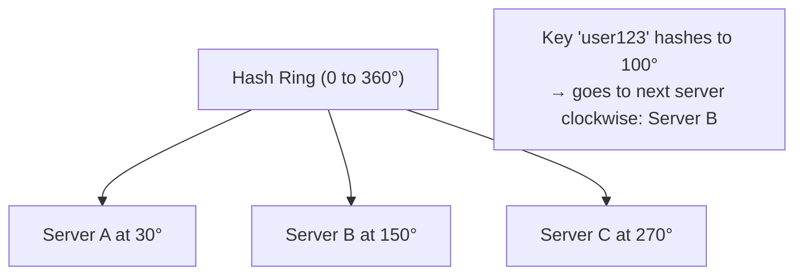

### Key words in simple terms
- **Bloom Filter**: a tiny, super-fast "maybe yes / definitely no" checker. *Example: Cassandra uses it to quickly check "does this key possibly exist on disk?" before doing an expensive disk read.*
- **Gossip Protocol**: instead of one central manager, nodes randomly tell a few neighbors "here's my status," and information spreads across the whole cluster over time — like rumors spreading in a school.
- **Distributed Lock**: making sure only ONE server does a specific job at a time, even though many servers could try. *Example: making sure only one instance of a scheduled nightly job actually runs, even if you have 5 copies of your app deployed.*

### 🎥 Video tutorial
- **Gaurav Sen** channel: search "Gaurav Sen consistent hashing" and "Gaurav Sen bloom filter" for focused whiteboard explanations.

### 🛠️ Hands-on task
1. On paper, draw a hash ring with 4 servers.
2. Manually place 5 sample keys on the ring and figure out which server each belongs to.
3. Now remove one server — figure out which keys have to move. Notice it's only some keys, not all of them — that's the whole point of consistent hashing.

---

## Suggested Study Order

1. Networking → 2. Operating Systems → 3. Linux → 4. Databases → 5. System Design Basics → 6. Distributed Systems Concepts → 7. Messaging Systems → 8. Caching → 9. Containers → 10. Kubernetes → 11. Cloud → 12. Observability → 13. API Design → 14. Security → 15. Architecture Patterns → 16. Algorithms

**Reminder:** Modules 7 (Kafka) and 10 (Kubernetes) are areas to go deeper on, since you already have experience there. Don't just watch the videos — do the hands-on tasks and try to break things on purpose, then fix them. That's how real understanding sticks.

**A note on the video links:** direct video links can sometimes go offline or get replaced by a newer version. If a link doesn't work, just search the video title (given right above each link) on YouTube — it will almost always still be there under the same name, or a newer, updated version will show up.