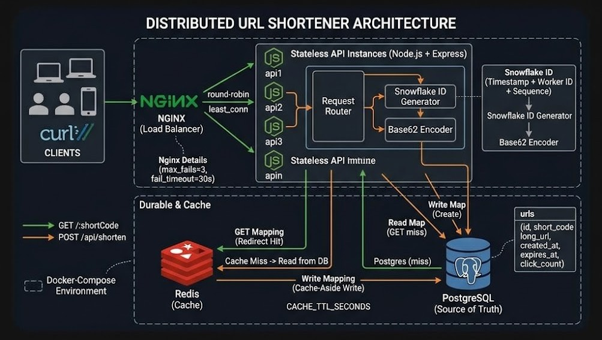

# URL Shortener (Node.js)

A teaching implementation of a **distributed URL shortener**. The surface API is simple — shorten a URL, redirect a short code — but the design touches the core ideas: **stateless APIs**, **durable storage**, **cache-aside**, **distributed unique IDs**, and a **load balancer**.

```
Client → Nginx (LB) → API (any instance)
                         ↓
               Snowflake ID → Base62
                         ↓
               Postgres (source of truth)
                         ↓
               Redis (cache for redirects)
```



## Stack

| Piece | Role |
|-------|------|
| Node.js + Express | Stateless HTTP API |
| PostgreSQL | Durable `short_code → long_url` store |
| Redis | In-memory cache (cache-aside on redirects) |
| Snowflake + Base62 | Collision-free short codes across workers |
| Nginx | Load balance across multiple API instances |

## Project layout

```
url-shortner/
├── docker-compose.yml      # Postgres, Redis, api1, api2, Nginx
├── Dockerfile
├── nginx/nginx.conf
├── package.json
├── .env.example
├── public/                 # Browser test UI
│   ├── index.html
│   ├── styles.css
│   └── app.js
└── src/
    ├── server.js           # Express app entry (serves UI + API)
    ├── routes/urls.js      # Shorten + redirect + inspect
    ├── id/
    │   ├── snowflake.js    # Distributed ID generator
    │   ├── base62.js       # URL-safe encoding
    │   └── snowflake.test.js
    ├── db/
    │   ├── schema.sql
    │   ├── pool.js
    │   └── migrate.js
    └── cache/redis.js      # Cache-aside helpers
```

## Quick start (Docker — recommended)

This brings up **two API workers** (different `WORKER_ID`s), Postgres, Redis, and Nginx on port **8081**.

Open the UI: [http://localhost:8081](http://localhost:8081)

```bash
cd projects/basics/url-shortner
docker compose up -d
```

### Try it

```bash
# Shorten
curl -s -X POST http://localhost:8081/api/shorten \
  -H 'Content-Type: application/json' \
  -d '{"url":"https://example.com/some/long/path"}'

# Redirect (follow with -L, or inspect Location header)
curl -sI http://localhost:8081/<short_code>

# Inspect (no redirect)
curl -s http://localhost:8081/api/urls/<short_code>

# Health (note worker_id may flip between 1 and 2)
curl -s http://localhost:8081/health
```

## Local dev (single process)

1. Start only Postgres + Redis:

```bash
docker compose up -d postgres redis
```

2. Install and run the API:

```bash
cp .env.example .env
npm install
npm run migrate
npm run dev
```

API listens on `http://localhost:3000`.

## How the pieces fit

### Stateless API
Any instance can handle any request. No session affinity. That is why Nginx can round-robin (actually `least_conn`) across `api1` and `api2`.

Open-source Nginx does not actively probe `/health`. Upstream peers use `max_fails=3 fail_timeout=30s`: after 3 failed proxy attempts, that peer is skipped for 30s. (Active health checks need Nginx Plus or something like HAProxy.)

### Snowflake IDs
Each process gets a unique `WORKER_ID` (1 and 2 in Compose). IDs pack timestamp + worker + sequence, so two servers never collide without a shared counter.

### Base62
Numeric Snowflake IDs become short strings like `aZ3kP9` using `0-9a-zA-Z`.

### Cache-aside redirect
1. Look up `short_code` in Redis  
2. On miss → read Postgres → write Redis → redirect  
3. Postgres remains the source of truth if Redis is empty or restarts  

### Postgres schema
`urls(id, short_code, long_url, created_at, expires_at, click_count)` — see `src/db/schema.sql`.

## Environment

See `.env.example`. Important vars:

- `WORKER_ID` — unique per API instance (0–1023)
- `DATABASE_URL` / `REDIS_URL`
- `BASE_URL` — used when returning `short_url` (e.g. `http://localhost:8081`)
- `CACHE_TTL_SECONDS` — Redis TTL for mappings

## Smoke-test ID generation

```bash
npm run test:id
```

## API

| Method | Path | Description |
|--------|------|-------------|
| `POST` | `/api/shorten` | Body `{ "url": "...", "expiresInDays"?: n }` |
| `GET` | `/:shortCode` | 302 redirect (cache-aside) |
| `GET` | `/api/urls/:shortCode` | JSON metadata |
| `GET` | `/health` | Liveness + DB/Redis check |

## What to explore next

- Rate limiting at Nginx or in the API
- Async click analytics (queue + worker instead of sync `UPDATE`)
- TTL / expiry sweeper job
- Custom aliases (`POST` with optional `alias`)
- Observability: request latency histograms for cache hit vs miss
